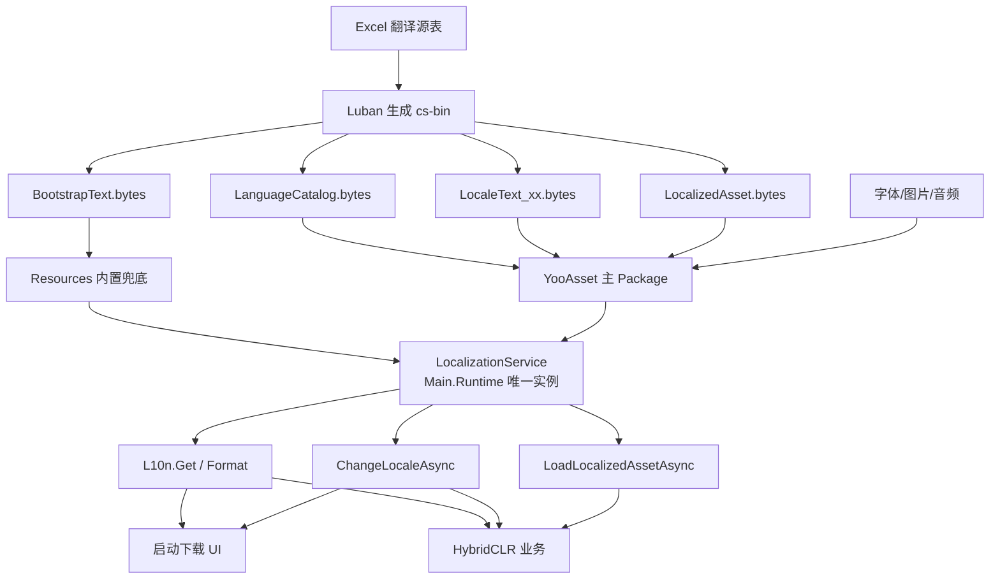
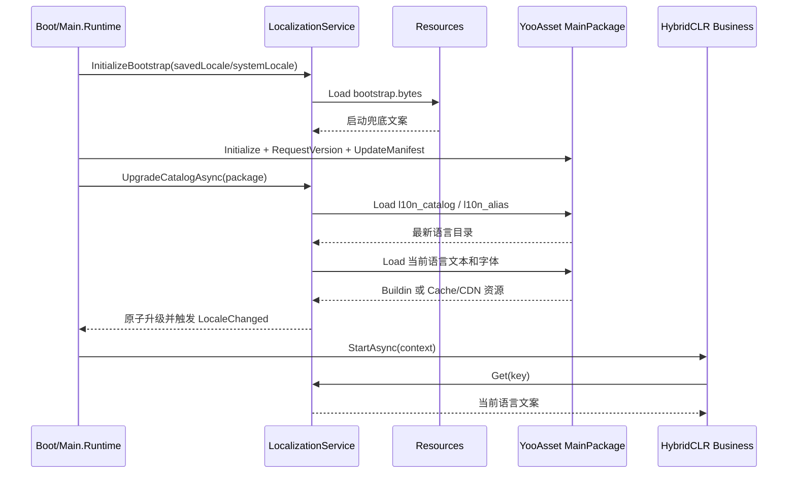

# Luban 多语言设计

更新时间：2026-08-18  
适用工程：Unity 2021.3.41f1c1、QFramework、YooAsset 2.3.0-preview、HybridCLR、Luban

## 1. 目标与结论

当前工程同时存在两套轻量本地化实现：

- `Main.Runtime/HotfixLocalizationSettings.cs`：用 `HotfixLanguage enum` 和 ScriptableObject 保存启动阶段中英文文案。
- QFramework `LocaleKit`：用固定 `Language enum`、Resources 中的 `LanguageDefineConfig` 以及 Prefab 上的 `LanguageTexts` 切换文案。

二者都不适合作为完整热更多语言系统：增加一种语言需要修改枚举或 Prefab，不能只发布配置和资源。

推荐目标是：

> Luban 是唯一语言数据源；`Main.Runtime` 持有唯一运行时服务；Resources 保存最小启动兜底表；YooAsset 保存可更新的语言目录、业务文案、字体和图片；语言用 BCP-47 字符串标识，不使用枚举。

统一的是 Key、表结构、查询 API 和语言状态，不强行统一所有阶段的物理加载来源。YooAsset 初始化失败时，Resources 兜底仍然必要。

## 2. 当前工程事实

| 项目 | 当前实现 |
|---|---|
| Luban 输入 | `LubanConfig/DataTables/Datas` |
| Luban 配置 | `LubanConfig/DataTables/luban.conf` |
| 客户端格式 | `gen.bat` 使用 `-d bin -c cs-bin` |
| 数据输出 | 当前有效资源位于 `Assets/AssetsPackage/AssetsHotFix/Datas/bin` |
| YooAsset 收集 | `AssetBundleCollectorSetting.asset` 已收集整个 `AssetsHotFix/Datas` |
| 加载示例 | `PreloadConfigCommand` 通过 `YooAssetKit.LoadAssetLeaseAsync<TextAsset>` 加载并用 `ByteBuf` 解析 |
| 启动文案 | `HotfixLocalizationSettings` 从 Resources 加载 |
| 热更入口 | `IHotfixEntry.StartAsync(HotfixContext)`，上下文提供主 Package 和版本信息 |

迁移前需先修正或统一生成脚本路径：`gen.bat` 使用了 `AssetsHotfix`，仓库目录和构建常量使用 `AssetsHotFix`。在区分大小写的文件系统或 CI 上可能生成到错误目录。`gen.sh` 还是另一套旧的 JSON 输出参数，也应收口为与 `gen.bat` 相同的客户端二进制产物。

## 3. 总体架构



### 程序集边界

```text
Main.Runtime（首包/AOT）
├── ILocalizationService
├── LocalizationService
├── L10n 静态门面
├── Luban 多语言生成类型
├── ResourcesBootstrapLoader
└── YooAssetLocalizationLoader
          ▲
          │ 只依赖稳定 API
HotfixCommon / HotfixDemo（HybridCLR）
├── 业务调用 L10n.Get(key)
└── UI 组件订阅 LocaleChanged
```

服务必须位于 `Main.Runtime`，因为请求版本、下载资源、加载 AOT metadata 和热更 DLL 之前已经需要文案。热更程序集不能拥有第二个本地化单例。

## 4. 关键 Luban 表设计

以下是推荐的逻辑表。具体 Excel 标题行应按工程现有 Luban 版本语法建立；表名和字段语义应保持稳定。

### 4.1 `TbLanguageCatalog`：可用语言目录

职责：动态声明客户端当前可选择的语言。新增语言只新增记录和 YooAsset 资源，不修改 C# 枚举。

主键：`locale`

| 字段 | 类型 | 示例 | 说明 |
|---|---|---|---|
| `locale` | string | `ja-JP` | 稳定 BCP-47 ID，禁止用枚举或数组下标持久化 |
| `displayName` | string | `日本語` | 语言选择界面的本语言名称 |
| `fallbackLocale` | string | `en` | 当前语言缺失 Key 时的回退语言 |
| `enabled` | bool | `true` | 是否对用户开放 |
| `sortOrder` | int | `30` | 列表排序 |
| `textTableAddress` | string | `l10n_text_ja-JP` | 当前语言业务文本表的 YooAsset 地址 |
| `downloadTag` | string | `l10n.ja-JP` | 按需下载 Tag |
| `fontGroup` | string | `CJK_JP` | 字体配置组 ID |
| `rtl` | bool | `false` | 是否从右到左排版 |
| `minAppVersion` | string | 空 | 可选；语言依赖新版首包能力时限制最低版本 |

示例：

| locale | displayName | fallbackLocale | enabled | sortOrder | textTableAddress | downloadTag | fontGroup | rtl |
|---|---|---|---:|---:|---|---|---|---:|
| `zh-CN` | 简体中文 | `en` | true | 10 | `l10n_text_zh-CN` | `l10n.zh-CN` | `CJK_SC` | false |
| `en` | English |  | true | 20 | `l10n_text_en` | `l10n.en` | `Latin` | false |
| `ja-JP` | 日本語 | `en` | true | 30 | `l10n_text_ja-JP` | `l10n.ja-JP` | `CJK_JP` | false |

约束：

- `locale`、`textTableAddress`、`downloadTag` 全局唯一。
- `fallbackLocale` 必须存在且不能形成环。
- 不保存语言枚举整数；PlayerPrefs 保存 `locale` 字符串。
- 目录表应很小，在更新 YooAsset Manifest 后优先加载。

### 4.2 `TbLanguageAlias`：系统语言映射

职责：数据驱动地把系统/渠道语言代码映射到游戏 Locale，避免首包代码写死每一种语言。

主键：`sourceCode`

| 字段 | 类型 | 示例 | 说明 |
|---|---|---|---|
| `sourceCode` | string | `zh-Hans` | 系统或渠道返回的语言代码 |
| `locale` | string | `zh-CN` | 映射到 `TbLanguageCatalog.locale` |
| `priority` | int | `100` | 多来源匹配优先级 |

建议匹配顺序：保存的用户选择 → 完整代码精确匹配 → Alias → 主语言匹配 → 默认 `en`。

### 4.3 `TbBootstrapText`：启动安全文案

职责：YooAsset 尚未初始化、远端 Manifest 不可用时仍能显示错误和恢复操作。

推荐使用联合主键：`key + locale`。

| 字段 | 类型 | 示例 | 说明 |
|---|---|---|---|
| `key` | string | `startup.download.failed` | 稳定文本 Key |
| `locale` | string | `zh-CN` | 语言 ID |
| `text` | string | `下载失败：{0}` | 文案模板 |

该表由 Luban 生成后额外复制到：

```text
Assets/AssetsPackage/Resources/Localization/bootstrap.bytes
```

它只包含启动配置、YooAsset 初始化、版本请求、下载、缓存降级、AOT 和 DLL 加载等关键文案。体积较小，建议内置默认语言与英语；产品要求离线可切换的语言也应内置。

### 4.4 `TbLocaleText_<locale>`：每语言业务文本

职责：完整业务文案；每种语言单独生成一个文件，避免选择日语时下载所有语言。

主键：`key`

| 字段 | 类型 | 示例 | 说明 |
|---|---|---|---|
| `key` | string | `ui.login.title` | 稳定文本 Key |
| `text` | string | `ログイン` | 当前文件对应语言的译文 |
| `comment` | string | `登录页标题` | 可选，仅供翻译和检查，可不输出客户端 |

推荐产物：

```text
Assets/AssetsPackage/AssetsHotFix/Datas/Localization/
├── l10n_catalog.bytes
├── l10n_alias.bytes
├── l10n_text_zh-CN.bytes
├── l10n_text_en.bytes
└── l10n_text_ja-JP.bytes
```

如果翻译团队更习惯宽表，可以使用 `key | zh-CN | en | ja-JP` 作为编辑源，但生成阶段仍应拆成每语言独立二进制文件。不要生成带 `ChineseSimplified/English/Japanese` 固定字段的运行时 Bean。

### 4.5 `TbLocalizedAsset`：本地化资源映射

职责：字体、Sprite、AudioClip、Prefab 等非文本资源的地址映射。

推荐联合主键：`key + locale`。

| 字段 | 类型 | 示例 | 说明 |
|---|---|---|---|
| `key` | string | `ui.event.banner` | 业务资源 Key |
| `locale` | string | `ja-JP` | 语言 ID |
| `assetType` | string | `Sprite` | `Sprite/Font/Audio/Prefab` 等稳定类别 |
| `assetAddress` | string | `banner_event_ja-JP` | YooAsset 地址 |
| `fallbackKey` | string | 空 | 可选资源级回退 Key |
| `downloadTag` | string | `l10n.ja-JP` | 对应按需下载 Tag |

`assetType` 可以是固定的资源类别枚举，因为新增的是语言，不是运行时资源加载能力。真正需要新增一种资源类别时通常本来就需要更新代码。

### 4.6 `TbFontGroup`：字体组

主键：`id`

| 字段 | 类型 | 示例 | 说明 |
|---|---|---|---|
| `id` | string | `CJK_JP` | 被语言目录引用 |
| `primaryFontAddress` | string | `font_noto_jp` | TMP 主字体地址 |
| `fallbackFontAddresses` | list,string | `font_symbol` | fallback 字体地址列表 |
| `materialAddress` | string | `font_noto_jp_mat` | 可选字体材质 |
| `downloadTag` | string | `l10n.ja-JP` | 下载 Tag |

## 5. 运行时查询与覆盖规则

唯一服务建议提供：

```csharp
public interface ILocalizationService
{
    string CurrentLocale { get; }
    string Get(string key);
    string Format(string key, params object[] args);
    Task ChangeLocaleAsync(string locale, CancellationToken cancellationToken);
    event Action<string> LocaleChanged;
}
```

文本查询顺序：

```text
当前语言 YooAsset 业务表
→ 当前语言 Resources Bootstrap 表
→ fallback 语言 YooAsset 业务表
→ fallback 语言 Resources Bootstrap 表
→ 默认英语
→ 返回 Key 并记录 Missing Key
```

业务表允许覆盖同名 Bootstrap Key，因此更新 Manifest 并加载新表后，启动 UI 也可以得到修订后的文案。表解析成功后应构造新字典并一次替换，禁止边解析边修改正在使用的字典。

Key 使用字符串，推荐由生成器额外生成常量：

```csharp
L10n.Get(L10nKeys.StartupDownloadFailed);
```

底层 API 仍接受字符串，使新增 Key 可以随 HybridCLR DLL 和数据热更，不要求首包更新枚举。

## 6. 首包与热更加载时序



推荐接入点：

1. `Boot.Start` 最前面初始化 Bootstrap。
2. Package 初始化、版本请求和 Manifest 更新期间只依赖 Bootstrap。
3. 最新 Manifest 可用后加载 `l10n_catalog`。
4. 若当前语言 Tag 尚未下载，按启动策略下载；失败时继续使用 Bootstrap/fallback，不破坏 LastGood 启动。
5. 加载 AOT/Hotfix DLL 前后均使用同一个 `L10n` 门面。

`LanguageCatalog`、默认语言文本和启动关键字体若要求首包可用，应加入现有启动必需 Tag（当前常量为 `HotfixRuntimeSettings.DefaultStartupTag`），并由构建校验确认被 YooAsset Collector 收集。其他语言用独立 Tag 按需下载。

## 7. 热更新新增一种语言

以新增 `ja-JP` 为例：

1. `TbLanguageCatalog` 新增 `ja-JP`，配置 fallback、文本地址、字体组和 Tag。
2. `TbLanguageAlias` 增加 `ja`、`ja-JP` 等映射。
3. 生成 `l10n_text_ja-JP.bytes`。
4. 增加日语 TMP 字体、图片等资源，地址写入 `TbLocalizedAsset/TbFontGroup`。
5. YooAsset Collector 为这些资源设置 `l10n.ja-JP` Tag。
6. 构建并上传普通 YooAsset 热更包。
7. 客户端更新 Manifest 后加载最新 Catalog，语言列表自动出现“日本語”。
8. 用户选择后下载对应 Tag，解析成功后保存 `ja-JP` 并原子切换。

只要首包已经具备通用字符串 Locale、通用表解析和字体/图片加载能力，以上过程不需要修改 Player，也不需要给 `HotfixLanguage` 增加成员。

## 8. LocaleKit 的处理建议

现有 QFramework `LocaleKit` 不建议继续作为数据权威，原因如下：

- `CurrentLanguage` 类型是固定 `Language enum`。
- `LanguageDefineConfig` 固定从 Resources 加载。
- 保存的是 `CURRENT_LANGUAGE_INDEX`，插入或调整语言顺序后含义会变化。
- `LocaleText` 在每个 Prefab 中保存全部 `LanguageTexts`，增加语言需要修改和重新发布 Prefab。
- `LocaleText.UpdateText` 使用 `First`，译文缺失会直接抛异常。
- 当前组件只直接处理 `UnityEngine.UI.Text` 和 `TextMesh`，未形成完整 TMP/字体/图片资源链路。

可保留其 `BindableProperty`/生命周期注销思路，但建议新增数据驱动组件，例如：

```text
LocalizedText
├── key: ui.login.title
├── argumentsProvider（可选）
└── 订阅 LocalizationService.LocaleChanged
```

组件只存 Key，不存每种语言的实际文本。迁移期可让 `LocaleKit.CurrentLanguage` 适配到新服务，但最终应只保留一个语言状态源。

## 9. 构建期校验

Luban 生成或发布前至少校验：

- Locale、文本 Key、资源地址和 Tag 唯一。
- 所有启用语言都能回退到有效语言，且 fallback 无环。
- 默认语言和 Bootstrap 必需 Key 完整。
- 各语言 `{0}`、`{1}` 等格式参数集合一致。
- 文本中没有空译文；允许缺失时必须能命中 fallback。
- Catalog 引用的表、字体和资源确实存在。
- 默认语言/Catalog 带启动必需 Tag；按 Tag 下载配置包含该 Tag。
- YooAsset 地址与生成表名完全一致。
- `AssetsHotFix` 路径大小写在 Windows、macOS 和 CI 中一致。

## 10. 推荐迁移步骤

1. 收口 `gen.bat/gen.sh`，保证同样生成 `cs-bin` 到真实的 `AssetsHotFix` 目录。
2. 建立五张核心表：Catalog、Alias、BootstrapText、LocaleText、LocalizedAsset；字体组可第二阶段加入。
3. 在 `Main.Runtime` 实现服务和 Resources Bootstrap Loader，暂时保留 `HotfixText` 作为适配门面。
4. 用生成的 Bootstrap 数据替换 `HotfixLocalizedText[]`，但暂不删除旧资产。
5. 在 Manifest 更新后接入 YooAsset Catalog/业务表升级。
6. 将启动调用从 `HotfixTextKey enum` 迁移到字符串 Key 常量。
7. 新增 Key-only UI 组件，逐步替换 Prefab 内嵌 `LocaleText.LanguageTexts`。
8. 完成断网、Manifest 失败、缺表、缺 Key、fallback、运行时切换和新增语言回归后，删除 `HotfixLocalizationSettings` 的文案数组及固定语言枚举。

## 11. 必测场景

| 场景 | 期望结果 |
|---|---|
| 首次安装且断网 | Resources Bootstrap 能显示默认语言/英语错误，不出现空白或 Key |
| CDN Manifest 失败但有 LastGood | 使用相容缓存语言表进入游戏 |
| 当前语言表下载失败 | 保持旧字典或 fallback，不清空 UI |
| 热更新新增 `ja-JP` | 更新 Manifest 后语言列表出现日语，无需更新 Player |
| 删除或禁用已选择语言 | 下次启动按 fallback/default 恢复，并更新保存值 |
| 翻译缺少格式参数 | 构建失败，不把有风险的表发布到 CDN |
| 切换语言时 UI 已打开 | 订阅组件刷新，字体和图片同步切换 |
| 连续快速切换语言 | 取消旧请求，最后一次选择生效，YooAsset Handle 无泄漏 |

## 12. 需求与首查位置

| 需求/问题 | 首查位置 |
|---|---|
| 修改 Luban 表和生成参数 | `LubanConfig/DataTables` |
| 检查生成数据是否被收集 | `Assets/Resources/AssetBundleCollectorSetting.asset` |
| 检查启动语言兜底 | `Assets/AssetsPackage/Scripts/Main/Runtime/HotfixLocalizationSettings.cs` |
| 检查 Package 初始化和 Manifest 时序 | `Assets/AssetsPackage/Scripts/Main/Runtime/Procedure` |
| 参考 Luban + YooAsset 加载 | `Assets/AssetsPackage/Scripts/Hotfix/HotfixDemo/PreloadConfigCommand.cs` |
| 检查热更业务上下文 | `Assets/AssetsPackage/Scripts/Main/Runtime/IHotfixEntry.cs` |
| 评估旧 UI 本地化组件 | `Assets/3rd/QFramework/Toolkits/_CoreKit/LocaleKit` |

本文档主体描述目标设计；仓库当前落地范围以“P0 实施状态”章节为准，后续仍应逐步迁移业务 UI。

## 13. P0 实施状态（2026-08-18）

本轮已经完成最小可运行闭环：

- 新增 `LubanConfig/Localization`，以 XML Schema + CSV 维护 Catalog、Alias、Bootstrap 和业务文本。
- `gen.sh/gen.bat` 统一生成 `cs-bin`，并将 Bootstrap 复制到 Resources。
- `Main.Runtime` 新增唯一 `LocalizationService`，语言使用字符串 Locale，并区分 `RequestedLocale/ActiveLocale`。
- `Boot` 在 YooAsset 初始化前同步加载 Bootstrap。
- Manifest 可用后进入 `ProcedureLoadLocalization`，从当前主 Package 加载动态 Catalog、Alias 和业务文本；失败继续使用 Bootstrap。
- 旧 `HotfixText` 已兼容转发到新服务，尚未迁移的 Key 回落旧 ScriptableObject。
- 新增 Player 构建前校验：默认语言、fallback 环、重复 ID、空字段、格式参数一致性和生成文件存在性。

当前 P0 采用单个 `tblocaletext.bytes` 承载所有业务语言，以先建立可靠闭环。后续语言数量或表体积增长后，再扩展为每语言独立表和按 Tag 下载；外部 `L10n` API、字符串 Locale 与 Catalog 结构无需改变。

尚未纳入本轮 P0：TMP 字体组、本地化图片/音频、Key-only UI 组件、语言包下载进度界面，以及完全删除旧 `HotfixLocalizationSettings`。

## 14. 第二阶段实施状态（2026-08-18）

本轮已经增加：

- `TbFontGroup` 与 `TbLocalizedAsset` Luban 表。
- 事务式 `ChangeLocale`：精确计算目标语言文本/字体地址、创建 YooAsset Bundle Downloader、加载字体，全部成功后才提交。
- 连续切换通过请求版本号废弃旧请求；失败保持旧语言、旧字体和旧 UI。
- `LocaleDownloadProgress`、`IsChangingLocale`、`LastChangeError` 状态。
- `LocalizedText`、`LocalizedTMPText`、`LocalizedImage` Key-only 组件。
- TMP 字体 Handle 随语言快照交接，本地化 Sprite Handle 随组件生命周期释放。
- 启动 Catalog 升级后复用同一事务激活当前请求语言。
- 构建门禁增加字体组、本地化资源表和生成产物检查。

当前语言文本仍由单个 `tblocaletext.bytes` 承载；现有 YooAsset Collector 也仍收集整个 `AssetsHotFix/Datas` 目录。因此本阶段使用 `CreateBundleDownloader(location)` 做地址级精确下载，尚未宣称完成真正的“每语言独立 Bundle/Tag”。要获得语言包级物理隔离，需要把每语言产物生成到独立目录，并为各目录配置独立 Collector、Pack Rule 和 `l10n.<locale>` Tag。
