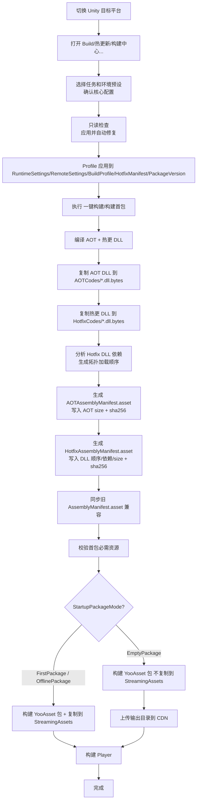
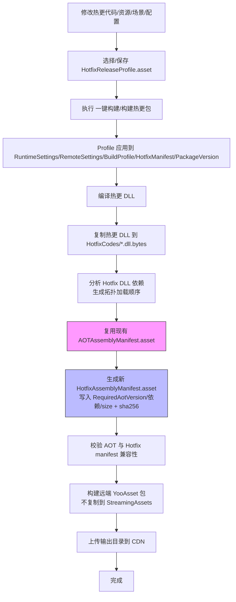
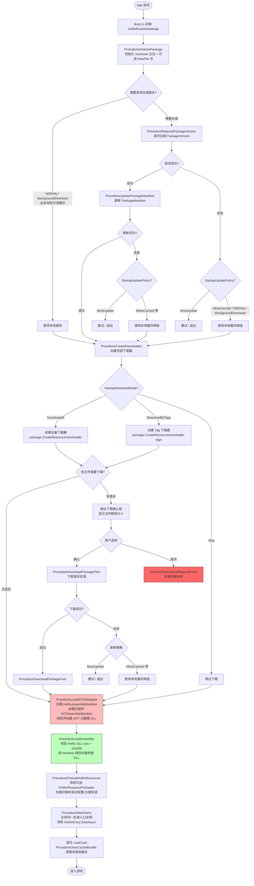
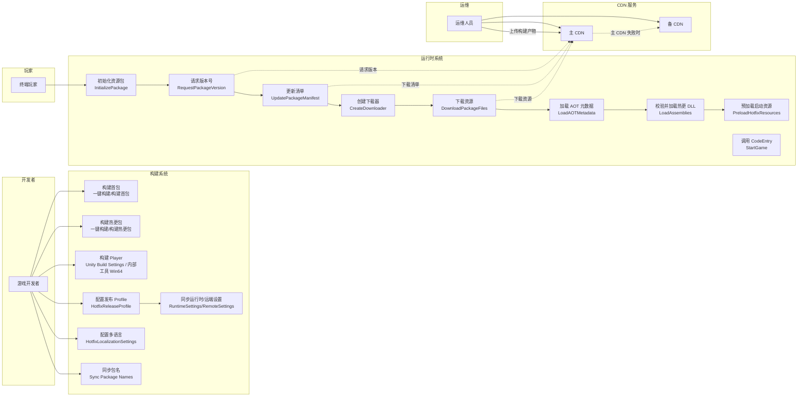
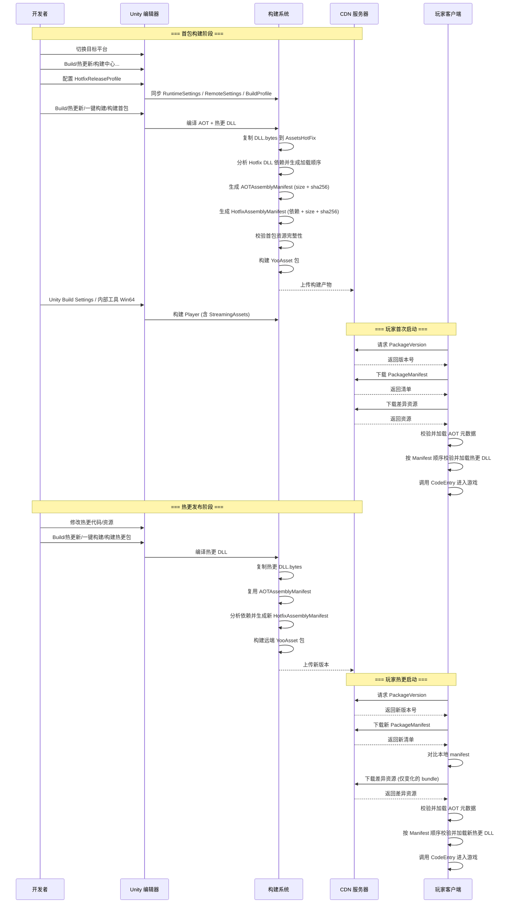

# qframework-hotfix

基于 **QFramework + YooAsset + HybridCLR** 的 Unity 热更新示例工程。

当前工程已支持：

- YooAsset 资源版本、远端 manifest、差异下载和本地缓存兜底。
- HybridCLR 热更 DLL 加载和 AOT 元数据补充。
- `AOTAssemblyManifest` 和 `HotfixAssemblyManifest` 分离，支持根据 `RequiredAotVersion` 匹配 AOT 版本。
- 首包、空包、离线包三种启动策略。
- 开发、测试、预发、正式环境 CDN 配置，支持主/备 CDN、平台、渠道、地区组合。
- 启动阶段下载确认、取消、重试、本地缓存降级和多语言提示。

## 环境要求

- Unity：`2022.3.62f2`
- YooAsset：`2.3.0-preview`
- HybridCLR：项目 `Packages/manifest.json` 中的 `com.code-philosophy.hybridclr`
- Luban：项目 `Packages/manifest.json` 中的 `com.code-philosophy.luban`
- 目标平台需先在 Unity Hub 安装对应 Build Support，例如 Android、iOS、WebGL、Windows、macOS。

首次打开工程后，建议先等待 Unity 完成 Package 导入和脚本编译。

## 快速开始

1. 打开项目。

   ```text
   /Users/mac/UnityFramework/qframework-hotfix
   ```

2. 切换目标平台。

   在 Unity 菜单 `File/Build Settings` 中选择目标平台并点击 `Switch Platform`。热更 DLL、AOT metadata 和 AssetBundle 都和平台相关，不能跨平台混用。

3. 安装 HybridCLR。

   ```text
   HybridCLR/Installer/Install
   ```

   不再建议新手直接执行 `HybridCLR/Generate/All`。首包构建时优先通过 `Build/热更新/构建中心...` 或一键构建入口触发统一流程。

4. 检查 HybridCLR 热更程序集。

   打开 `ProjectSettings/HybridCLRSettings.asset`，确认 `Hot Update Assembly Definitions` 包含需要热更的 asmdef。当前示例包括：

   ```text
   HotfixCommon
   HotfixDemo
   ```

5. 检查 YooAsset 收集器。

   打开 `YooAsset/AssetBundle Collector`，确认 `DefaultPackage` 至少收集以下路径：

   ```text
   Assets/AssetsPackage/AssetsHotFix/AOTCodes
   Assets/AssetsPackage/AssetsHotFix/HotfixCodes
   Assets/AssetsPackage/AssetsHotFix/Configs
   Assets/AssetsPackage/AssetsHotFix/HotfixDemo
   Assets/AssetsPackage/AssetsHotFix/Datas
   ```

   如果使用 `StartupDownloadMode = DownloadByTags`，启动必需资源所在 Collector 必须配置 `AssetTags = startup`，至少包括 `AOTCodes`、`HotfixCodes`、`Configs`、`Datas`，以及 CodeEntry 启动阶段会立即加载的场景 / Prefab / 配置等资源。

6. 打开构建中心。

   ```text
   Build/热更新/构建中心...
   ```

   构建中心按任务向导展示日常发布需要的核心配置：

   ```text
   ① 选择构建首包资源 / 构建热更资源
   ② 选择开发 / 测试 / 预发 / 正式环境预设
   ③ 确认平台、版本、CDN、启动策略和热更入口
   ④ 只读检查 → 应用并自动修复 → 构建资源
   ```

   `只读检查` 不会改写 PlayerSettings、RuntimeSettings、RemoteSettings 或 Manifest；只有“应用并自动修复”和实际构建才会同步 Profile。AOT 元数据补丁、复制 Profile 和导出 JSON 位于高级工具折叠区。

7. 选择或保存 ReleaseProfile。

   默认发布配置位于：

   ```text
   Assets/Editor/HybridCLR/HotfixReleaseProfile.asset
   ```

   ReleaseProfile 统一管理 BuildTarget、AppVersion、兼容版本区间、ResourceVersion、HotfixVersion、远端环境、渠道、地区、CDN、PlayerPlayMode、启动策略、启动下载 Tag 和 CodeEntry。构建会先应用 ReleaseProfile，再生成 manifest 和资源包。
   选中 `HotfixReleaseProfile.asset` 后，Inspector 中带 `*` 的字段是发布前需要确认的配置；灰色字段是自动生成或由底层 asset 派生的只读状态。

8. 在 ReleaseProfile 中选择启动包策略。

   优先在 `HotfixReleaseProfile.asset` 中设置：

   - `StartupPackageMode = FirstPackage`：首包内置启动资源，最常用。
   - `StartupPackageMode = EmptyPackage`：空包不内置资源，首次启动必须能访问远端。
   - `StartupPackageMode = OfflinePackage`：离线包完整内置资源，`PlayerPlayMode` 必须设置为 `OfflinePlayMode`。

   构建会把 ReleaseProfile 的启动策略、PlayerPlayMode 和 CDN 选择同步到底层 asset。`HotfixRuntimeSettings.asset`、`HotfixRemoteSettings.asset`、`HotfixBuildProfile.asset` 仍保留给运行时和构建预处理器读取，不再作为发布策略的首选编辑入口。

9. 构建热更资源包。

   首包或首次远端资源：

   ```text
   Build/热更新/一键构建/构建首包
   ```

   后续热更资源：

   ```text
   Build/热更新/一键构建/构建热更包
   ```

10. 构建 Player。

   Windows 示例内部菜单：

   ```text
   Build/热更新/内部工具/旧命令/构建 Win64 Player
   ```

   其他平台可以使用 Unity `Build Settings`，构建前预处理器会校验 Player PlayMode、远端配置和启动包策略。

## 目录结构

```text
Assets/AssetsPackage
├── AssetsHotFix
│   ├── AOTCodes          # AOT metadata DLL.bytes
│   ├── HotfixCodes       # 热更程序集 DLL.bytes
│   ├── Configs           # AOTAssemblyManifest、HotfixAssemblyManifest、兼容旧清单
│   ├── HotfixDemo        # 示例热更资源
│   │   ├── Entities
│   │   └── Scenes        # 示例场景，当前 HotfixDemo CodeEntry 会加载 main
│   └── Datas             # 配表等热更数据
└── Scripts
    ├── Main              # 首包主工程代码，负责启动、下载和加载热更
    └── Hotfix            # 热更业务代码，编译为热更程序集
```

关键配置：

| 路径 | 用途 |
| --- | --- |
| `ProjectSettings/HybridCLRSettings.asset` | HybridCLR 热更程序集和 AOT metadata 配置 |
| `Assets/Resources/AssetBundleCollectorSetting.asset` | YooAsset 包和资源收集器配置 |
| `Assets/Editor/HybridCLR/HotfixBuildProfile.asset` | ReleaseProfile 同步出的平台 PlayerPlayMode，运行时构建预处理器读取 |
| `Assets/AssetsPackage/Resources/HotfixRuntimeSettings.asset` | ReleaseProfile 同步出的启动策略、下载策略、更新策略；包名仍从 YooAsset Collector 同步 |
| `Assets/AssetsPackage/Resources/HotfixRemoteSettings.asset` | ReleaseProfile 同步出的环境、渠道、地区、主/备 CDN 地址 |
| `Assets/AssetsPackage/Resources/HotfixLocalizationSettings.asset` | 启动阶段中文和英文提示 |
| `Assets/Editor/HybridCLR/HotfixReleaseProfile.asset` | 发布配置主入口，绑定 BuildTarget、AppVersion、ResourceVersion、HotfixVersion、远端环境、CDN、启动策略、PlayerPlayMode 和 CodeEntry |
| `Assets/AssetsPackage/AssetsHotFix/Configs/AOTAssemblyManifest.asset` | AOT 版本、平台、App 版本、AOT DLL 列表、size 和 sha256 |
| `Assets/AssetsPackage/AssetsHotFix/Configs/HotfixAssemblyManifest.asset` | Hotfix 版本、兼容 App 版本、RequiredAotVersion、热更 DLL、size / sha256、依赖顺序、CodeEntry |
| `Assets/AssetsPackage/AssetsHotFix/Configs/AssemblyManifest.asset` | 旧清单，保留用于兼容和迁移 |

## 首包构建流程



## 热更包构建流程



## 运行时启动流程



## 用例图



## 角色与职责

| 角色 | 职责 | 关键操作 |
| --- | --- | --- |
| 游戏开发者 | 开发热更代码和资源，配置发布 Profile | 编写热更代码、配置 ReleaseProfile、构建首包/热更包、构建 Player |
| 运维人员 | 管理 CDN 和版本发布 | 上传构建产物到 CDN、监控版本分发、回滚版本 |
| 终端玩家 | 运行游戏客户端 | 启动 App、确认下载、等待热更完成、进入游戏 |

## 构建与热更时序



## 运行时流程

入口脚本：

```text
Assets/AssetsPackage/Scripts/Main/Runtime/Boot.cs
```

启动流程：

1. `Boot` 读取 `HotfixRuntimeSettings.asset`。
2. 初始化 YooAsset。
3. 创建 `ProcedureManager`。
4. `ProcedureInitializePackage` 初始化主资源包和可选 RawFile 包。
5. `ProcedureRequestPackageVersion` 请求远端 package version。
6. `ProcedureUpdatePackageManifest` 更新 package manifest。
7. `ProcedureCreateDownloader` 根据启动下载策略创建 downloader。
8. `ProcedureDownloadPackageFiles` 下载缺失或 hash 变化的 bundle。
9. `ProcedureLoadAOTMetadata` 先加载 `HotfixAssemblyManifest`，再加载匹配的 `AOTAssemblyManifest` 和 AOT metadata。
10. `ProcedureLoadAssembly` 按 `HotfixAssemblyManifest.HotUpdateAssemblies` 顺序校验并加载热更 DLL，并记录本次可用的 `HotfixVersion + AotVersion` 组合。
11. `ProcedureLoadAssembly` 创建一次 `IHotfixEntry` 入口实例和 `HotfixContext`。
12. `ProcedurePreloadHotfixResources` 检查同一入口是否实现可选的 `IHotfixResourcePreloader`；实现时等待预加载完成，未实现时直接通过。
13. `ProcedureStartGame` 复用同一入口实例和上下文，等待 `IHotfixEntry.StartAsync` 真正完成。
14. 业务启动成功后提交 LastGood，再由 `ProcedureClearCacheBundle` 清理未使用缓存。

预加载失败或取消会直接阻断 `StartGame`，也不会提交 LastGood。Procedure 只负责生命周期、进度、取消和错误处理；Luban、JSON、本地化等具体业务资源仍由热更入口实现。

弱网或远端异常时，`StartupUpdatePolicy` 决定是否可以使用本地缓存或首包内置资源启动。

## 启动包策略

`HotfixRuntimeSettings.asset` 中的 `StartupPackageMode` 用来明确包体形态。

### FirstPackage

首包模式，推荐默认使用。

首包必须包含：

- 启动场景和主工程代码。
- YooAsset 内置 package manifest。
- `AOTAssemblyManifest.asset`。
- `HotfixAssemblyManifest.asset`。
- AOT metadata DLL.bytes。
- 首版热更 DLL.bytes。
- CodeEntry 启动阶段会立即加载的场景、Prefab 或其他入口资源。
- 展示更新 UI、错误提示、本地缓存降级所需资源。

通过 `Build/热更新/构建中心...` 或 `Build/热更新/一键构建/构建首包` 构建时会校验框架可识别的启动资源是否存在，并把 YooAsset 构建产物复制到 `StreamingAssets`。CodeEntry 内部立即加载的业务资源需要放入启动 Collector；使用 `DownloadByTags` 时还需要带 `startup` Tag。

### EmptyPackage

空包模式不内置 YooAsset 启动资源，适合必须从远端拉取首个资源版本的场景。

要求：

- `PlayerPlayMode` 必须是 `HostPlayMode` 或 `WebPlayMode`。
- 首次启动时远端必须可访问。
- 启动下载策略建议使用 `DownloadAll`；如果使用 `DownloadByTags`，`StartupDownloadTags` 必须包含 `startup`，且启动资源 Collector 必须带 `startup` Tag。
- 构建 `Build/热更新/一键构建/构建首包` 会生成远端资源包，但不会复制到 `StreamingAssets`。

空包不能搭配 `OfflinePlayMode`。如果远端不可用且本地从未成功缓存过资源，首次启动会失败并给出明确错误。

### OfflinePackage

离线包模式完整内置启动资源，不依赖远端。

要求：

- `StartupPackageMode = OfflinePackage`
- `PlayerPlayMode = OfflinePlayMode`
- 构建阶段会校验 AOT、Hotfix、manifest 和 CodeEntry 启动资源完整性。

离线包适合 Demo、审核包、展会包、内网包或不需要远端热更的发行形态。

## Runtime Settings

日常发布不要直接改这个 asset。它是运行时 `Resources.Load` 读取的同步产物，发布字段由 ReleaseProfile 写入；只有包名、RawFile 包这类 YooAsset Collector 派生信息需要通过构建中心的“应用并自动修复”同步确认。

`Assets/AssetsPackage/Resources/HotfixRuntimeSettings.asset` 核心字段：

| 字段 | 说明 |
| --- | --- |
| `EditorPlayMode` | Editor 下使用的 YooAsset PlayMode |
| `PlayerPlayMode` | Player 下使用的 YooAsset PlayMode |
| `MainPackageName` | 主包名，默认 `DefaultPackage` |
| `IncludeRawFilePackage` | 是否启用 RawFile 包 |
| `RawFilePackageName` | RawFile 包名，默认 `RawFilePackage` |
| `StartupPackageMode` | `FirstPackage`、`EmptyPackage`、`OfflinePackage` |
| `StartupDownloadMode` | `DownloadAll`、`DownloadByTags`、`Skip` |
| `StartupUpdatePolicy` | `MustUpdate`、`AllowCached`、`WifiOnly`、`BackgroundDownload` |
| `StartupDownloadTags` | 主包启动阶段下载 Tag |
| `RawFileStartupDownloadTags` | RawFile 包启动阶段下载 Tag |

RawFile 包名由 YooAsset Collector 派生并通过“应用并自动修复”同步；RawFile 下载 Tag 则由 ReleaseProfile 统一管理并同步到 RuntimeSettings。启用 `DownloadByTags` 时，主包和 RawFile 包分别使用各自的 Tag 数组，RawFile Tag 为空或 Collector 中不存在对应 Tag 都会阻断构建，运行时也不会静默跳过。

`StartupDownloadMode`：

- `DownloadAll`：下载全部差异资源。
- `DownloadByTags`：只下载指定 Tag。启动阶段必须包含 `startup`，否则构建会失败。
- `Skip`：跳过启动下载，直接尝试加载当前本地可用资源。

`StartupUpdatePolicy`：

- `MustUpdate`：远端失败时只能重试或退出。
- `AllowCached`：远端失败时允许使用上次可用缓存或首包内置资源。
- `WifiOnly`：非 Wi-Fi 环境优先使用本地可用版本。
- `BackgroundDownload`：已有可用缓存时优先本地启动，后台下载入口由业务层继续接入。

## Remote Settings

日常发布不要直接改这个 asset。环境选择和目标环境的 CDN 模板由 ReleaseProfile 写入；这个 asset 保留给运行时解析远端地址和应急覆盖。

Host/Web 模式远端地址由：

```text
Assets/AssetsPackage/Resources/HotfixRemoteSettings.asset
```

控制。不要在代码里写死 CDN 地址。

每个环境可以配置：

- `mainCdnUrlTemplate`：主 CDN 地址模板。
- `fallbackCdnUrlTemplate`：备用 CDN 地址模板，不能和主 CDN 完全相同。
- `requireHttps`：是否强制 HTTPS。
- `allowedDomains`：允许访问的域名白名单。
- `certificatePinningEnabled` 和 `certificatePublicKeyPin`：证书 pinning 预留。
- `enableGrayRelease`、`grayReleasePercent`、灰度 CDN 模板：CDN 灰度预留。

地址模板支持：

```text
{Environment}
{Platform}
{Channel}
{Region}
{PackageName}
```

示例：

```text
https://cdn.example.com/GameName/{Platform}/{Channel}/{Region}/{PackageName}
https://cdn-backup.example.com/GameName/{Platform}/{Channel}/{Region}/{PackageName}
```

运行时可以用 PlayerPrefs 覆盖环境、渠道、地区：

```csharp
PlayerPrefs.SetString("Hotfix.Remote.Environment", "Production");
PlayerPrefs.SetString("Hotfix.Remote.Channel", "official");
PlayerPrefs.SetString("Hotfix.Remote.Region", "cn");
PlayerPrefs.Save();
```

也可以直接覆盖主/备 CDN 模板：

```csharp
PlayerPrefs.SetString("Hotfix.Remote.MainUrl", "https://cdn.example.com/GameName/{Platform}/{Channel}/{Region}/{PackageName}");
PlayerPrefs.SetString("Hotfix.Remote.FallbackUrl", "https://cdn-backup.example.com/GameName/{Platform}/{Channel}/{Region}/{PackageName}");
PlayerPrefs.Save();
```

命令行覆盖：

```text
--hotfix-env=Production
--hotfix-channel=official
--hotfix-region=cn
--hotfix-main-url=https://cdn.example.com/GameName/{Platform}/{Channel}/{Region}/{PackageName}
--hotfix-fallback-url=https://cdn-backup.example.com/GameName/{Platform}/{Channel}/{Region}/{PackageName}
```

## Manifest 协议

当前运行时不再依赖单一 `AssemblyManifest`，而是使用两份清单。

### AOTAssemblyManifest

路径：

```text
Assets/AssetsPackage/AssetsHotFix/Configs/AOTAssemblyManifest.asset
```

字段：

- `AppVersion`：该 AOT metadata 对应的 App 版本。
- `BuildTarget`：平台，例如 `Windows`、`Android`、`iOS`、`macOS`。
- `AotVersion`：由 AppVersion、BuildTarget、AOT DLL 文件名、SHA256、大小生成。
- `AotMetadataAssemblies`：需要加载 metadata 的 AOT DLL 列表。
- `AotMetadataFiles`：AOT DLL 的 fileName、size 和 sha256 记录。

### HotfixAssemblyManifest

路径：

```text
Assets/AssetsPackage/AssetsHotFix/Configs/HotfixAssemblyManifest.asset
```

字段：

- `AppVersionMin`：最小兼容 App 版本。
- `AppVersionMax`：最大兼容 App 版本。
- `BuildTarget`：平台。
- `RequiredAotVersion`：本次热更需要的 AOT 版本。
- `HotfixVersion`：由兼容版本、平台、RequiredAotVersion、热更 DLL 文件名、SHA256、大小生成。
- `HotUpdateAssemblies`：构建期按 DLL 内部依赖拓扑排序后的热更 DLL 加载顺序。
- `HotUpdateFiles`：热更 DLL 的 fileName、size 和 sha256 记录。
- `HotUpdateDependencies`：每个热更 DLL 的内部依赖关系，用于构建中心和构建报告展示。
- `EntrySceneAddress`：已废弃，场景加载交给 CodeEntry 管理。
- `EntryPrefabAddress`：已废弃，Prefab 加载交给 CodeEntry 管理。
- `EntryTypeName`：实现 `IHotfixEntry` 且带公共无参构造函数的热更入口类型完整名。
- `EntryMethodName`：旧静态入口兼容字段；当前 `IHotfixEntry` 协议不再使用，构建时保持为空。

运行时会校验：

- Hotfix manifest 和 AOT manifest 是否存在。
- `AppVersionMin <= Application.version <= AppVersionMax`。
- `BuildTarget` 是否匹配当前运行平台。
- `HotfixAssemblyManifest.RequiredAotVersion == AOTAssemblyManifest.AotVersion`。
- AOT DLL 和热更 DLL 列表不能为空。
- `EntryTypeName` 必填，入口类型必须实现 `IHotfixEntry` 并带公共无参构造函数。
- AOT / Hotfix hash 记录不能缺失、重复或包含额外 DLL，sha256 必须是 64 位十六进制。
- AOT Metadata bytes 加载前校验 size + sha256。
- Hotfix DLL `Assembly.Load(bytes)` 前校验 size + sha256。

校验失败会终止热更流程并显示明确错误。

### Hotfix DLL 依赖顺序

热更 DLL 的加载顺序由构建期自动生成，开发者不需要手动调整 `HotUpdateAssemblies`。

构建流程会读取每个 Hotfix DLL 的 `AssemblyName` 和 `ReferencedAssemblies`，只保留 Hotfix DLL 之间的内部依赖，然后执行拓扑排序：

```text
如果 A.dll 依赖 B.dll：
    B.dll 会写在 A.dll 前面
```

构建期会阻断以下情况：

- 循环依赖。
- 重复 `AssemblyName`。
- Manifest 记录了 DLL 但文件不存在。
- HotfixCodes 目录中存在未记录到 Manifest 的 DLL。
- 依赖记录过期，和当前 DLL metadata 不一致。

构建中心会显示最终 DLL 加载顺序、依赖关系和发布 Profile；`BuildReports/Hotfix/*.txt` 会输出 ResourceVersion / PackageVersion、DLL 加载顺序、依赖关系，以及 AOT / Hotfix DLL 的 size 和 sha256。

## ReleaseProfile

ReleaseProfile 是发布配置入口，默认文件：

```text
Assets/Editor/HybridCLR/HotfixReleaseProfile.asset
```

它统一管理：

- `BuildTarget`
- `AppVersion`
- `AppVersionMin` / `AppVersionMax`
- `ResourceVersion` / `HotfixVersion`
- `RemoteEnvironment` / `Channel` / `Region`
- `MainCdnUrlTemplate` / `FallbackCdnUrlTemplate`
- `RequireHttps` / `AllowedDomains` / 灰度 CDN 配置
- `PlayerPlayMode`
- `StartupPackageMode` / `StartupDownloadMode` / `StartupDownloadTags` / `RawFileStartupDownloadTags`
- `EntryTypeName` / `EntryMethodName`
- `AllowDevelopmentCdn`

选中 `HotfixReleaseProfile.asset` 后会看到定制 Inspector：

- 带 `*` 的字段是发布前需要确认的配置。
- `ResourceVersion` / `HotfixVersion`、域名白名单、证书 pinning 和灰度 CDN 是可选覆盖 / 高级配置。
- 灰色区域是自动生成或同步状态，例如底层 `HotfixRuntimeSettings.asset`、`HotfixRemoteSettings.asset`、`HotfixBuildProfile.asset` 的当前值、AOT / Hotfix manifest 版本、CDN 解析结果和最新构建报告。

构建中心会绑定并直接编辑当前 ReleaseProfile。环境预设使用现有 `RemoteEnvironment` 作为唯一事实来源，并从 `HotfixRemoteSettings.asset` 载入对应环境的 CDN 配置：

- 开发 / 测试：自动启用 Unity Development Build，`LogKit` 输出完整日志。
- 预发 / 正式：关闭 Development Build，`LogKit` 仅输出 Error / Exception。
- 正式：强制 Production、HTTPS、MustUpdate，并要求固定 ResourceVersion、递增 ReleaseSequence 和 Manifest 签名。
- 打开构建中心、切换 Profile 或创建默认 Profile 时，空的 `ResourceVersion` 会按 `yyyy-MM-dd-HHmmss` 自动预填；可以直接修改，也可以点击“重新生成”。
- 构建中心的校验报告按“必须修复 / 建议修复 / 构建信息”分组，顶部显示通过、警告、错误数量；构建阶段会显示当前阶段、耗时和产物目录。
- 构建完成后可直接打开输出目录、复制 CDN 上传目录或查看构建报告。
- 正式环境在开始构建前会弹出最终摘要，要求再次确认环境、App/资源版本、主备 CDN、签名 KeyId/私钥变量和 `ReleaseSequence`。

不再需要配置 `ENABLE_LOG`。如曾误把它填写到 `Additional Compiler Arguments`，应删除；编译参数会把裸 `ENABLE_LOG` 当作源文件路径并产生 `CS2001`。

完整 Profile Inspector、复制 Profile 和导出 JSON 保留在高级工具中，供特殊发布或 CI 使用。

`HotfixReleaseProfile` 的 Inspector 仅作为高级编辑、底层设置同步、诊断和 Profile 复制入口。日常发布统一使用 `Build/热更新/构建中心...`，以确保经过统一校验、正式发布二次确认和构建产物交付操作。

一键构建会先应用 ReleaseProfile：

- 写入 `PlayerSettings.bundleVersion`。
- 写入 `HotfixRuntimeSettings.asset` 的 PlayerPlayMode、启动包策略、下载策略和启动 Tag。
- 写入 `HotfixBuildProfile.asset` 的当前平台 PlayerPlayMode。
- 写入 `HotfixRemoteSettings.asset` 的默认环境、渠道、地区和目标环境 CDN 模板。
- 写入 `HotfixAssemblyManifest.asset` 的兼容 App 版本、HotfixVersion 和 CodeEntry。
- `ResourceVersion` 直接作为 YooAsset `PackageVersion`；构建中心默认按 `yyyy-MM-dd-HHmmss` 预填，构建命令在字段为空时也使用相同规则兜底。
- Collector 中存在 RawFile 包时，主包和 RawFile 包使用同一个 `PackageVersion`；RawFile 包名与清单 SHA-256 会写入并签名到 `HotfixAssemblyManifest.asset`。
- Manifest 签名协议新构建使用 v2；运行时仍可验证旧 v1 AOT/Hotfix 清单，但正式环境启用 RawFile 时必须使用带 RawFile 绑定的 v2 Hotfix 清单。

正式发布建议设置：

```text
RemoteEnvironment = Production
AllowDevelopmentCdn = false
```

当 `RemoteEnvironment = Production` 或 `AllowDevelopmentCdn = false` 时，构建中心和 Player Build 预处理器都会阻断 Development 环境或本地回环 CDN，避免正式包误连开发 CDN。

## 发布 SOP

本节是从配置到发包的完整执行清单。日常发布优先按这里走，下面的“构建首包”“构建热更包”“上传 CDN”章节保留更多细节。

### 发布前配置

1. 切换 Unity 目标平台。
2. 检查 `ProjectSettings/HybridCLRSettings.asset`，确认所有热更 asmdef 已加入 `Hot Update Assembly Definitions`。
3. 打开 `Build/热更新/构建中心...`，选择或创建 `HotfixReleaseProfile.asset`。
4. 在构建中心选择任务和开发 / 测试 / 预发 / 正式环境预设，并确认核心配置：
   - `BuildTarget`、`AppVersion`。
   - `AppVersionMin` / `AppVersionMax`。
   - `ResourceVersion`，即 YooAsset `PackageVersion`；默认按 `yyyy-MM-dd-HHmmss` 预填，可手动修改或点击“重新生成”。主包和 RawFile 包共用该版本。
   - `HotfixVersion`，通常留空自动生成；需要外部版本协议时再固定。
   - `RemoteEnvironment` / `Channel` / `Region`。
   - `MainCdnUrlTemplate` / `FallbackCdnUrlTemplate` / `RequireHttps` / `AllowedDomains` / 灰度 CDN 配置。
   - `PlayerPlayMode`：`FirstPackage` / `EmptyPackage` 常用 `HostPlayMode`，WebGL 使用 `WebPlayMode`；`OfflinePackage` 使用 `OfflinePlayMode`。
   - `StartupPackageMode` / `StartupDownloadMode` / `StartupUpdatePolicy` / `StartupDownloadTags` / `RawFileStartupDownloadTags`。
   - `EntryTypeName` / `EntryMethodName`。
   - 正式发布设置 `RemoteEnvironment = Production` 且 `AllowDevelopmentCdn = false`。
5. 点击 `只读检查`。该操作不会同步或改写底层设置；先处理所有红色错误。
6. 点击 `应用并自动修复`，确认变更摘要后，把 ReleaseProfile 同步到 `PlayerSettings`、`HotfixRuntimeSettings.asset`、`HotfixRemoteSettings.asset`、`HotfixBuildProfile.asset` 和 `HotfixAssemblyManifest.asset`，并从 Collector 同步包名。
7. 检查无错误后，点击 `构建首包资源` 或 `构建热更资源`；构建前会再次显示环境、平台、版本和 CDN 摘要。

### 资源收集

1. 打开 `YooAsset/AssetBundle Collector`。
2. 确认主包名和 `HotfixRuntimeSettings.asset` 的 `MainPackageName` 一致；可通过构建中心的 `应用并自动修复` 从 Collector 同步。
3. `DefaultPackage` 至少收集：

   ```text
   Assets/AssetsPackage/AssetsHotFix/AOTCodes
   Assets/AssetsPackage/AssetsHotFix/HotfixCodes
   Assets/AssetsPackage/AssetsHotFix/Configs
   Assets/AssetsPackage/AssetsHotFix/Datas
   Assets/AssetsPackage/AssetsHotFix/HotfixDemo
   ```

4. CodeEntry 启动阶段会立即加载的场景、Prefab、配置和表数据必须被 Collector 收集。
5. 如果 `StartupDownloadMode = DownloadByTags`：
   - ReleaseProfile 的 `StartupDownloadTags` 必须包含 `startup`。
   - 启动必需资源所在 Collector 的 `AssetTags` 必须包含 `startup`。
   - 至少包括 `AOTCodes`、`HotfixCodes`、`Configs`、`Datas` 和 CodeEntry 首帧必需资源。
   - 启用 RawFile 包时，`RawFileStartupDownloadTags` 不能为空，并且每个 Tag 都必须真实存在于 RawFile 包的 Group 或 Collector 上。
6. 当前运行时支持一个主包和最多一个 RawFile 包。发现多个次包时构建会明确阻断，避免静默漏构建。

### 首包发布

1. 在构建中心选择 `构建首包资源` 和目标环境预设。
2. 执行 `只读检查`，没有红色错误后点击 `应用并自动修复`。
3. 点击 `构建首包资源`。

4. 构建会先生成 RawFile 包并计算其 YooAsset Manifest SHA-256，再写入并签名 `HotfixAssemblyManifest.asset`，最后构建包含签名清单的主包。
5. 主包构建完整成功后会生成 Editor-only 的 `Assets/Editor/HybridCLR/PlayerAOTBaseline.asset`，作为后续 AOT 元数据补丁不可覆盖的 Player 身份基线。
6. `FirstPackage` 和 `OfflinePackage` 会先清空并复制主包，再追加 RawFile 包到 `StreamingAssets`；两个包不会互相清空。随后构建 Player。
7. `EmptyPackage` 不会复制到 `StreamingAssets`；先上传首版远端资源，再构建 Player。
8. 如果首包也需要远端更新能力，把输出目录上传到目标 CDN。

### 热更包发布

1. 修改热更代码、资源、场景或配置。
2. 更新 ReleaseProfile：
   - 通常递增或指定 `ResourceVersion`。
   - 必要时调整 `AppVersionMin` / `AppVersionMax`。
   - 不改 AOT 基线时保持同一 App 基线。
3. 检查新增资源是否已进入 YooAsset Collector，启动资源是否仍满足 `startup` tag 规则。
4. 在构建中心选择 `构建热更资源` 并执行 `只读检查`。
5. 点击 `应用并自动修复`，然后点击 `构建热更资源`。

6. 构建会复用现有 `AOTAssemblyManifest.asset`，生成同版本的主包和 RawFile 包，并把 RawFile 清单摘要绑定到新的 `HotfixAssemblyManifest.asset`。
7. 主包与 RawFile 包都要上传：分别把 `Bundles/{UnityBuildTarget}/{MainPackageName}/{PackageVersion}` 和 `Bundles/{UnityBuildTarget}/{RawFilePackageName}/{PackageVersion}` 上传到各自包名解析出的 CDN 根目录。
8. 上传后用浏览器或 `curl` 检查 package version、manifest 和 bundle 文件可访问。
9. 保存 `BuildReports/Hotfix/*.txt`、ReleaseProfile JSON、上传目录和版本号，作为发布记录和回滚依据。

### 发布后确认

- 构建报告中 `BuildTarget`、`AppVersion`、`ResourceVersion`、`PackageVersion`、`AotVersion`、`HotfixVersion` 符合本次发布。
- CDN 主/备地址都能访问版本文件和 manifest 文件。
- `HotfixAssemblyManifest.asset` 的 `RequiredAotVersion` 和首包 AOT 基线一致。
- 启用 RawFile 包时，构建报告同时包含 RawFile 包名、版本、输出/上传目录；`HotfixAssemblyManifest.asset` 的 RawFile 包名、版本和 Manifest SHA-256 都非空。
- 测试包启动后能完成版本请求、manifest 更新、资源下载和 CodeEntry 执行。
- 正式包没有连接 Development 环境或本地回环 CDN。

## 构建首包

常规首包推荐使用 `FirstPackage`。

步骤：

1. 切换 Unity 目标平台。
2. 打开 `Build/热更新/构建中心...`，选择或创建 ReleaseProfile。
3. 选择 `构建首包资源` 和目标环境预设。
4. 执行 `只读检查`，再点击 `应用并自动修复`，同步运行时包名和平台 PlayMode。
5. 检查 ReleaseProfile：

   ```text
   StartupPackageMode = FirstPackage
   PlayerPlayMode = HostPlayMode
   StartupDownloadMode = DownloadAll
   StartupUpdatePolicy = AllowCached
   ```

6. 检查 ReleaseProfile 的主/备 CDN 模板，确保目标平台、环境、渠道和地区解析出的地址合法。
7. 执行：

   ```text
   Build/热更新/一键构建/构建首包
   ```

该菜单会：

- 编译热更 DLL。
- 复制 AOT metadata 到 `AOTCodes/*.dll.bytes`。
- 复制热更 DLL 到 `HotfixCodes/*.dll.bytes`。
- 生成或更新 `AOTAssemblyManifest.asset`。
- 生成或更新 `HotfixAssemblyManifest.asset`。
- 同步旧 `AssemblyManifest.asset`，用于兼容迁移。
- 校验首包必需资源。
- 构建 YooAsset 包。
- `FirstPackage` 和 `OfflinePackage` 会复制构建产物到 `StreamingAssets`。
- YooAsset 主包完整成功后创建或更新 Editor-only 的 `PlayerAOTBaseline.asset`；失败构建不会覆盖已有基线。

YooAsset 默认输出目录：

```text
Bundles/{UnityBuildTarget}/{PackageName}/{PackageVersion}
```

示例：

```text
Bundles/StandaloneOSX/DefaultPackage/2026-04-30-153012
Bundles/StandaloneWindows64/DefaultPackage/2026-04-30-153012
```

构建日志会输出：

```text
[BuildYooAssetPackage] Output: ...
```

## 构建空包首版远端资源

空包不是不需要资源，而是不把资源内置进安装包。

步骤：

1. 在 ReleaseProfile 中设置：

   ```text
   StartupPackageMode = EmptyPackage
   PlayerPlayMode = HostPlayMode 或 WebPlayMode
   StartupDownloadMode = DownloadAll
   ```

2. 执行：

   ```text
   Build/热更新/一键构建/构建首包
   ```

3. 将输出目录内容上传到 ReleaseProfile 解析出的 CDN 根目录。
4. 构建 Player。

空包构建会生成完整 YooAsset 远端资源，但不会复制到 `StreamingAssets`。首次启动必须能请求远端 package version 和 package manifest。

## 构建离线包

步骤：

1. 在 ReleaseProfile 中设置：

   ```text
   StartupPackageMode = OfflinePackage
   PlayerPlayMode = OfflinePlayMode
   ```

2. 执行：

   ```text
   Build/热更新/一键构建/构建首包
   ```

3. 构建 Player。

离线包不会依赖 CDN，适合固定内容交付。后续如果要切回热更模式，需要重新设置 `StartupPackageMode` 和 `PlayerPlayMode`。

## 构建热更包

当修改热更代码、资源、场景或配置后，执行：

```text
Build/热更新/一键构建/构建热更包
```

该菜单会：

- 编译热更 DLL。
- 更新 `HotfixCodes/*.dll.bytes`。
- 复用当前 `AOTAssemblyManifest.asset`。
- 构建前校验 AOT 基线指纹、AppVersion、BuildTarget 和 AOTCodes 文件 hash。
- 自动分析 Hotfix DLL 内部依赖，生成稳定的 `HotUpdateAssemblies` 加载顺序和 `HotUpdateDependencies`。
- 写入 AOT Metadata / Hotfix DLL 的 fileName、size 和 sha256。
- 生成新的 `HotfixAssemblyManifest.asset`，其中 `RequiredAotVersion` 指向当前 AOT 版本。
- 校验 AOT 和 Hotfix manifest 兼容关系。
- 构建远端 YooAsset 包。
- 不复制到 `StreamingAssets`。
- 生成 `BuildReports/Hotfix/*.txt` 构建报告，并在报告中提示 CDN 上传目录。
- 构建报告会列出 Hotfix DLL 加载顺序、依赖关系，以及 AOT / Hotfix DLL hash。

热更构建不会移除 AOT 收集器。输出目录是一个完整资源版本目录，客户端会通过 YooAsset manifest 对比本地缓存，只下载缺失或 hash 变化的 bundle。AOT metadata 没变化时不会重复下载。

如果普通热更构建检测到 AOT 基线变化，会阻断构建并提示选择：

- `构建首包`：建立新的 App 基线。
- `构建 AOT 元数据补丁`：只在同一 App 基线下补充元数据。
- `取消`：停止本次构建。

## 构建 AOT 元数据补丁

AOT 元数据补丁是高级模式，只适用于：

```text
AOT 代码逻辑没有变化
但 Hotfix 需要补充新的泛型元数据
```

菜单：

```text
Build/热更新/高级/构建 AOT 元数据补丁
```

该流程会：

- 弹出风险确认。
- 要求存在首包成功构建后生成的 Editor-only 独立基线：`Assets/Editor/HybridCLR/PlayerAOTBaseline.asset`。
- 校验基线格式、AppVersion、BuildTarget、Unity 版本、Player/HybridCLR 构建身份和基线自身指纹。
- 执行安全版 HybridCLR Generate All。
- 对 Generate All 产出的全量裁剪 AOT DLL 逐个比对 fileName、size 和 sha256；任何新增、变化或移除都会在改写 Manifest 前阻断。
- 复制 AOT metadata DLL 和 Hotfix DLL。
- 重新生成 `AOTAssemblyManifest.asset` 和 `HotfixAssemblyManifest.asset`。
- 构建远端 YooAsset 包。
- 不复制到 `StreamingAssets`。
- 在构建报告中记录 Player 基线指纹、旧/新 `AotVersion`、旧/新 Manifest 指纹，以及 AOT Metadata DLL 的新增/变化/移除列表。
- 构建成功后弹出结果摘要，可直接打开输出目录或查看报告。

独立 Player AOT 基线遵循以下规则：

- 只有首包资源完整构建成功后才会创建或更新；构建失败不会污染已有可信基线。
- AOT 元数据补丁只读取并验证它，不会覆盖它。
- 基线位于 `Assets/Editor`，不会进入 Player 或 YooAsset 运行时资源。
- 基线资产应和对应 App 的 ReleaseProfile、构建报告一起提交版本控制并归档；团队成员和 CI 必须使用同一份基线，不能在补丁发布前临时重建。
- `patchAOTAssemblies` 不参与 Player 构建身份指纹，因为调整 metadata 选择正是该任务的用途；但选择出的 DLL 必须仍来自与首包完全一致的全量裁剪 AOT 输出。
- Player 构建身份包含 Unity/平台/AppVersion、应用标识、ScriptingBackend、API Compatibility、Managed Stripping、IL2CPP 编译配置、CPU 架构、宏与编译参数、HybridCLR 配置、`Packages/packages-lock.json` 和原生插件/SDK 源文件及导入配置摘要。身份变化时必须发布新 App。

旧项目迁移：如果构建中心提示缺少 `PlayerAOTBaseline.asset`，不能直接继续发布 AOT 补丁。请切换到“构建首包资源”，在与实际 Player 相同的平台、AppVersion 和构建设置下重新建立首包基线；随后需要以该首包构建新的 App。不能用新生成的基线冒充已经发布但没有基线记录的旧 App。

如果修改了主工程 AOT 代码逻辑、公共接口、原生 SDK 或 PlayerSettings，应发布新 App，而不是发布 AOT 元数据补丁。

## 上传 CDN

构建输出目录形如：

```text
Bundles/{UnityBuildTarget}/{PackageName}/{PackageVersion}
```

将该目录下的文件上传到 ReleaseProfile 最终解析出的 URL 根目录。YooAsset 请求文件时会把文件名拼到根目录后面。

启用 RawFile 包时会生成两个同版本目录，必须分别上传，且 CDN 模板要保留 `{PackageName}` 或等价的包名隔离路径：

```text
Bundles/{UnityBuildTarget}/DefaultPackage/{PackageVersion}
Bundles/{UnityBuildTarget}/RawFilePackage/{PackageVersion}
```

本地测试可以使用简单 HTTP 服务。示例：

```bash
cd Bundles/StandaloneOSX/DefaultPackage/2026-04-30-153012
python3 -m http.server 8080
```

然后把 ReleaseProfile 的开发环境 CDN 模板临时设置为：

```text
http://127.0.0.1:8080
```

备用 CDN 不能和主 CDN 完全相同，可以使用另一个端口或另一个本地目录：

```bash
python3 -m http.server 8081
```

```text
http://127.0.0.1:8081
```

正式环境建议：

- 使用 HTTPS。
- 主/备 CDN 域名不同。
- 上传后校验版本文件、manifest 文件和 bundle 文件数量。
- 保留上一稳定版本，便于回滚。
- 不修改 YooAsset 生成的文件名。

## 构建 Player

Windows 示例：

```text
Build/热更新/内部工具/旧命令/构建 Win64 Player
```

该菜单会：

- 校验目标平台是否为 Windows。
- 应用 ReleaseProfile 中的 PlayerPlayMode，并同步到底层 settings。
- 执行 `PrebuildCommand.GenerateAll()`。
- 构建 `Assets/Scenes/Boot.unity`。
- 构建首包 YooAsset 资源。
- 将 `StreamingAssets` 复制到 `Release-Win64/HybridCLRTrial_Data/StreamingAssets`。

其他平台可以用 Unity 原生 Build Settings。构建预处理器会调用：

```text
HotfixBuildProfileUtility.ApplyPlayModeToRuntimeSettingsForBuild
```

并校验：

- Player 不允许使用 `EditorSimulateMode`。
- WebGL 必须使用 `WebPlayMode`。
- 非 WebGL 不允许使用 `WebPlayMode`。
- `OfflinePackage` 必须使用 `OfflinePlayMode`。
- `EmptyPackage` 不允许使用 `OfflinePlayMode`。
- 远端配置必须通过目标平台校验。

## 按 Tag 下载

启动阶段统一保留 `startup` Tag。使用 `StartupDownloadMode = DownloadByTags` 时：

- ReleaseProfile 的 `StartupDownloadTags` 必须包含 `startup`。
- YooAsset Collector 中启动必需资源必须配置 `AssetTags = startup`。
- 构建前会校验 `Configs`、`AOTCodes`、`HotfixCodes`、`Datas`，以及 Hotfix manifest 兼容字段中仍显式配置的 `EntrySceneAddress` / `EntryPrefabAddress`；CodeEntry 启动阶段会立即加载的资源也应放入带 `startup` Tag 的 Collector。缺少收集器或缺少 `startup` Tag 会直接失败，并输出资源路径和所在 Collector。

步骤：

1. 在 YooAsset Collector 中给资源收集器配置 `AssetTags`，例如：

   ```text
   startup
   ui
   battle
   chapter_1
   ```

2. 设置 ReleaseProfile：

   ```text
   StartupDownloadMode = DownloadByTags
   StartupDownloadTags =
     startup
     ui
     battle
   ```

3. 重新构建 YooAsset 包。

业务中可以按 Tag 下载：

```csharp
YooAssetKit.DownloadByTagsAsync(
    new[] { "ui", "battle" },
    onCompleted: downloader =>
    {
        if (downloader.Status != YooAsset.EOperationStatus.Succeed)
        {
            UnityEngine.Debug.LogError(downloader.Error);
        }
    },
    onUpdate: data =>
    {
        UnityEngine.Debug.Log($"download progress: {data.Progress}");
    });
```

按 Tag 加载时也需要持有并释放资源租约：

```csharp
using (var leases = await YooAssetKit.LoadAssetsByTagLeaseAsync<UnityEngine.GameObject>("ui"))
{
    foreach (var prefab in leases.GetAssets())
    {
        // 在 leases.Dispose() 前使用资源，或把 leases 保存为长期成员。
        UnityEngine.Debug.Log(prefab.name);
    }
}
```

注意：按 Tag 加载前，相关 bundle 必须已经在本地可用。`DownloadByTags` 只保证 bundle 下载到本地，不代表资源已经加载、配置已经解析；启动必需配置应通过下面的预加载阶段准备。

## 热更资源预加载

启动链路在 `LoadAssemblies` 与 `StartGame` 之间预留了 `ProcedurePreloadHotfixResources`。热更入口按需实现 `IHotfixResourcePreloader`：

```csharp
public sealed class HotfixCodeEntry : IHotfixEntry, IHotfixResourcePreloader
{
    public async Task PreloadAsync(
        HotfixContext context,
        IProgress<HotfixPreloadProgress> progress)
    {
        context.CancellationToken.ThrowIfCancellationRequested();
        progress?.Report(new HotfixPreloadProgress(0f, "加载游戏配置"));

        using (var lease = await YooAssetKit.LoadAssetLeaseAsync<TextAsset>(
                   "tbperson",
                   context.MainPackageName))
        {
            context.CancellationToken.ThrowIfCancellationRequested();
            byte[] bytes = lease.Asset.bytes;
            // 必须在释放租约前完成解析或复制；把解析后的纯托管对象交给配置服务。
            GameConfig.SetTables(ParseTables(bytes));
        }

        progress?.Report(new HotfixPreloadProgress(1f, "游戏配置加载完成"));
    }

    public Task StartAsync(HotfixContext context)
    {
        // 只有 PreloadAsync 成功后才会执行。
        return StartBusinessAsync(context);
    }
}
```

RawFile 配置使用上下文中的明确资源包，读取 API 返回的数据已与 Handle 生命周期解耦：

```csharp
public async Task PreloadAsync(
    HotfixContext context,
    IProgress<HotfixPreloadProgress> progress)
{
    if (context.RawFilePackage == null)
    {
        throw new InvalidOperationException("RawFile package is not enabled.");
    }

    byte[] bytes = await YooAssetKit.LoadRawFileBytesAsync(
        context.RawFilePackage,
        "ConfigBytes");
    context.CancellationToken.ThrowIfCancellationRequested();
    GameConfig.SetTables(ParseTables(bytes));
    progress?.Report(new HotfixPreloadProgress(1f, "游戏配置加载完成"));
}
```

适合预加载 Luban 表、JSON/二进制配置、本地化、首屏所需少量 Prefab。角色全集、全量音频和全部关卡等大型资源应按业务阶段加载。Prefab、AudioClip 等 Unity 对象若要跨阶段使用，必须长期持有对应租约，并在业务模块退出时释放。

示例实现位于：

```text
Assets/AssetsPackage/Scripts/Hotfix/HotfixDemo/HotfixCodeEntry.cs
Assets/AssetsPackage/Scripts/Hotfix/HotfixDemo/PreloadConfigCommand.cs
Assets/AssetsPackage/Scripts/Hotfix/HotfixDemo/GameConfig.cs
```

## YooAssetKit 资源生命周期

`YooAssetKit` 使用显式资源租约管理 YooAsset Handle。加载成功后，资源的使用方同时拥有返回的 `YooAssetLease<T>`；租约存活期间资源引用有效，调用 `Dispose()` 后释放底层 Handle。

不要只保存 `lease.Asset` 而丢弃租约，也不要在仍使用资源时提前释放租约。

### 短生命周期资源

只在当前方法内读取配置、文本或纹理时，推荐使用 `using`：

```csharp
using (var lease = await YooAssetKit.LoadAssetLeaseAsync<TextAsset>("tbperson"))
{
    byte[] bytes = lease.Asset.bytes;
    // 在此处完成数据解析或复制。
}
```

同步加载同样返回租约：

```csharp
using (var lease = YooAssetKit.LoadAssetLeaseSync<Material>("RoleMaterial"))
{
    renderer.sharedMaterial = lease.Asset;
    // 如果 renderer 后续仍依赖该 Material，就不能在这里释放，应该改为长期持有。
}
```

### 长期持有资源

Prefab、AudioClip、Material 等会跨帧使用的资源，应把租约保存为成员，并在组件、系统或对象池销毁时释放：

```csharp
private YooAssetLease<GameObject> mPrefabLease;

private async UniTask LoadPrefabAsync()
{
    mPrefabLease?.Dispose();
    mPrefabLease = await YooAssetKit.LoadAssetLeaseAsync<GameObject>("Cube");

    GameObject instance = Instantiate(mPrefabLease.Asset);
}

private void OnDestroy()
{
    mPrefabLease?.Dispose();
    mPrefabLease = null;
}
```

回调式加载时，成功回调接管租约所有权。对象可能在加载完成前销毁，因此需要处理迟到回调：

```csharp
private bool mDestroyed;
private YooAssetLease<AudioClip> mAudioLease;

private void LoadAudio()
{
    YooAssetKit.LoadAssetLeaseAsync<AudioClip>("Bgm", lease =>
    {
        if (mDestroyed)
        {
            lease?.Dispose();
            return;
        }

        mAudioLease = lease;
        audioSource.clip = lease == null ? null : lease.Asset;
    });
}

private void OnDestroy()
{
    mDestroyed = true;
    mAudioLease?.Dispose();
}
```

### 子资源和批量资源

子资源租约持有对应的 `SubAssetsHandle`：

```csharp
using (var lease = await YooAssetKit.LoadSubAssetLeaseAsync<Sprite>(
           "UIAtlas",
           "ButtonNormal"))
{
    image.sprite = lease.Asset;
}
```

批量加载返回 `YooAssetLeaseCollection<T>`，释放集合会释放其中所有 Handle：

```csharp
private YooAssetLeaseCollection<GameObject> mUiPrefabLeases;

private async UniTask LoadUiPrefabsAsync()
{
    mUiPrefabLeases?.Dispose();
    mUiPrefabLeases = await YooAssetKit.LoadAssetsByTagsLeaseAsync<GameObject>(
        new[] { "ui", "common" });

    foreach (var prefab in mUiPrefabLeases.GetAssets())
    {
        UnityEngine.Debug.Log(prefab.name);
    }
}

private void OnDestroy()
{
    mUiPrefabLeases?.Dispose();
}
```

### 场景句柄

调用 `YooAssetKit.LoadSceneAsync` 并提供 `onCompleted` 时，成功的 `SceneHandle` 所有权转移给回调。不要在回调外假设句柄已经释放；Additive 场景应通过 `SceneHandle.UnloadAsync()` 卸载，场景卸载成功后 YooAsset 会自动释放该句柄。

```csharp
YooAssetKit.LoadSceneAsync(
    "Battle",
    UnityEngine.SceneManagement.LoadSceneMode.Additive,
    onCompleted: sceneHandle =>
    {
        mBattleSceneHandle = sceneHandle;
    });

// 退出战斗时：
var operation = mBattleSceneHandle.UnloadAsync();
```

### RawFile 与多包读取

RawFile 必须从明确的资源包读取，避免遗漏包名后误落到默认主包。热更入口可以直接使用 `HotfixContext.RawFilePackage`：

```csharp
public async Task StartAsync(HotfixContext context)
{
    if (context.RawFilePackage == null)
    {
        throw new InvalidOperationException("RawFile package is not enabled.");
    }

    byte[] configBytes = await YooAssetKit.LoadRawFileBytesAsync(
        context.RawFilePackage,
        "ConfigBytes");

    string configText = await YooAssetKit.LoadRawFileTextAsync(
        context.RawFilePackage,
        "ConfigText");
}
```

也可以使用显式包名重载：

```csharp
byte[] bytes = await YooAssetKit.LoadRawFileBytesAsync(
    context.RawFilePackageName,
    "ConfigBytes");
```

这些 API 会检查包是否已就绪、加载状态和返回数据，并在 `finally` 中释放 `RawFileHandle`；返回的 `byte[]` / `string` 不再依赖 Handle 生命周期。旧的 `LoadRawToByteAsync` / `LoadRawToStringAsync` 回调 API 已标记为 `Obsolete`。

正式环境或启用 Manifest 强校验时，启动流程会在 `IHotfixEntry.StartAsync` 前校验 RawFile 活动 YooAsset Manifest 的包名、版本和 SHA-256，确保它与主包中已签名的 `HotfixAssemblyManifest` 一致。LastGood 也同时记录 RawFile 包名和版本；更换 RawFile 包名后，旧的四字段 LastGood 记录不会被错误套用到新包。

### 旧 API 迁移

以下返回裸资源的 API 已标记为 `Obsolete`：

```text
LoadAssetSync / LoadAssetAsync
LoadGameObjectAsync
LoadSubAssetSync / LoadSubAssetAsync
LoadAssetsByTagAsync / LoadAssetsByTagsAsync
LoadRawToByteAsync / LoadRawToStringAsync
```

新代码应改用带 `Lease` 的 API。旧代码暂时无法迁移时，每次旧 API 加载都必须配对调用一次：

```csharp
YooAssetKit.ReleaseAsset(asset);
```

`ReleaseAllLegacyAssets()` 只适合退出游戏或自动化测试清理，不应作为日常资源释放方案。`TryUnloadUnusedAsset` 和 `UnloadUnusedAssets` 也不能替代租约释放：只要 Handle 仍被租约或兼容层持有，资源引用计数就不会归零。

## 下载取消和失败处理

启动阶段发现差异资源时，会弹出下载确认框：

- 点击确定：开始下载。
- 点击取消：触发 `OnDownloadCancelRequestEvent`，热更流程失败并显示取消原因。

业务代码可以主动取消：

```csharp
TypeEventSystem.Global.Send(new OnDownloadCancelRequestEvent
{
    reason = "用户取消资源下载。"
});
```

UI 层也可以调用：

```csharp
UIPanelRoot.Instance.RequestCancelDownload();
UIPanelRoot.Instance.RequestCancelDownloadWithReason("用户在下载中取消。");
```

下载失败后会提供重试或退出/使用本地缓存路径。`AllowCached`、`WifiOnly`、`BackgroundDownload` 会优先尝试上次可用缓存；`MustUpdate` 不使用缓存兜底。

## 多语言提示

启动阶段文案由：

```text
Assets/AssetsPackage/Resources/HotfixLocalizationSettings.asset
```

管理。

默认跟随系统语言。也可以覆盖：

```csharp
PlayerPrefs.SetString("Hotfix.Language", "English");
PlayerPrefs.Save();
```

命令行：

```text
--hotfix-language=ChineseSimplified
--hotfix-language=English
```

新增用户可见文案时，优先在 `HotfixTextKey` 中添加 key，并在 `HotfixLocalizationSettings.asset` 中补齐文本，再通过 `HotfixText.Get(...)` 使用。

## 常用菜单

```text
HybridCLR/Installer/Install
Build/热更新/构建中心...
Build/热更新/ReleaseProfile/创建或绑定默认 Profile
Build/热更新/ReleaseProfile/保存当前配置到 Profile
Build/热更新/ReleaseProfile/复制当前 Profile
Build/热更新/ReleaseProfile/导出当前 Profile JSON
Build/热更新/一键构建/构建首包
Build/热更新/一键构建/构建热更包
```

高级菜单需要明确风险后再使用：

```text
Build/热更新/高级/构建 AOT 元数据补丁
```

`内部工具` 下的菜单保留给框架维护、排障和分步验证，日常构建不需要手动点击：

```text
Build/热更新/内部工具/安全生成 HybridCLR 数据
Build/热更新/内部工具/仅构建首包 YooAsset
Build/热更新/内部工具/仅构建热更 YooAsset
Build/热更新/内部工具/复制 AOT 元数据 DLL
Build/热更新/内部工具/复制热更 DLL
Build/热更新/内部工具/校验运行时设置
Build/热更新/内部工具/旧命令/构建 Win64 Player
```

## 自检清单

构建前检查：

- 目标平台已切换。
- 已选择或创建 `HotfixReleaseProfile.asset`。
- ReleaseProfile 的 `BuildTarget`、`AppVersion`、`ResourceVersion`、远端环境、渠道、地区、主/备 CDN、PlayerPlayMode 和启动策略符合本次发布。
- 正式发布时 `RemoteEnvironment = Production` 且 `AllowDevelopmentCdn = false`。
- 构建中心的 `只读检查` 没有红色错误项。
- 热更 asmdef 已加入 HybridCLR Settings。
- YooAsset Collector 已收集 `AOTCodes`、`HotfixCodes`、`Configs`，以及 CodeEntry 启动阶段会立即加载的入口资源。
- 如果 `StartupDownloadMode = DownloadByTags`，`StartupDownloadTags` 和启动资源 Collector 都包含 `startup`。
- 启用 RawFile 且使用 `DownloadByTags` 时，`RawFileStartupDownloadTags` 非空且每个 Tag 都存在于 RawFile Collector。
- Collector 只有一个主包和最多一个 RawFile 次包；多余次包会被构建校验阻断。
- 灰色同步状态中 `HotfixRuntimeSettings.asset` 的包名与 Collector 一致。
- ReleaseProfile 的主/备 CDN 不相同，且灰色解析结果符合本次发布目录。
- `FirstPackage` / `OfflinePackage` 的启动资源完整。
- `EmptyPackage` 没有搭配 `OfflinePlayMode`。

构建后检查：

- `AOTAssemblyManifest.asset` 的 `BuildTarget` 和目标平台一致。
- `HotfixAssemblyManifest.asset` 的 `RequiredAotVersion` 等于 `AOTAssemblyManifest.asset` 的 `AotVersion`。
- `HotfixAssemblyManifest.asset` 的 App 兼容版本覆盖当前 `Application.version`。
- `HotfixAssemblyManifest.asset` 的 `HotUpdateAssemblies` 已按依赖排序。
- `AOTAssemblyManifest.asset` / `HotfixAssemblyManifest.asset` 已记录 DLL fileName、size 和 sha256。
- 启用 RawFile 时，主包与 RawFile 包的 `PackageVersion` 一致，构建报告包含两个输出目录，Hotfix Manifest 已记录 RawFile 包名、版本和 Manifest SHA-256。
- 输出目录存在版本文件、manifest 文件和 bundle 文件。
- 主包与 RawFile 包都已上传到各自 `{PackageName}` CDN 目录，用浏览器或 curl 能访问两套版本文件和 manifest 文件。

## 常见问题

### 热更包是否是真正增量？

构建输出是完整版本目录，客户端下载是增量。YooAsset 会通过 manifest 对比本地缓存，只下载缺失或 hash 变化的 bundle。

### 为什么热更包里还能看到 AOT 相关资源？

热更构建保留 AOT 收集器，保证远端 manifest 能表达完整资源版本。只要 AOT metadata 文件 hash 没变，客户端不会重复下载。

### App 版本不兼容怎么办？

检查 `HotfixAssemblyManifest.asset`：

- `AppVersionMin`
- `AppVersionMax`

当前 `Application.version` 必须落在这个区间内。不兼容时客户端会拒绝加载热更，并提示更新 App 或更新资源。

### 平台不兼容怎么办？

检查 `AOTAssemblyManifest.asset` 和 `HotfixAssemblyManifest.asset` 的 `BuildTarget`。Windows、Android、iOS、WebGL、macOS、Linux 的 DLL 和 AssetBundle 不能混用。

### 新增热更程序集后没有加载？

检查：

1. 新 asmdef 是否加入 `HybridCLR/Settings -> Hot Update Assembly Definitions`。
2. 是否通过构建中心或 `Build/热更新/内部工具/安全生成 HybridCLR 数据` 生成过 HybridCLR 数据，或至少重新编译热更 DLL。
3. 是否执行 `Build/热更新/一键构建/构建热更包`。
4. `HotfixAssemblyManifest.asset` 的 `HotUpdateAssemblies` 是否包含新增 DLL。
5. `BuildReports/Hotfix/*.txt` 中的 Hotfix DLL 加载顺序是否符合依赖关系。

### 修改资源后客户端下载不到？

检查：

1. 资源是否被 YooAsset Collector 收集。
2. 资源所在收集器是否有正确 Tag。
3. 是否上传了最新 YooAsset 输出目录。
4. ReleaseProfile 解析出的环境、平台、渠道、地区、包名目录是否正确。
5. CDN 是否缓存了旧版本文件。

### 何时必须重新发 App 包？

通常包括：

- 修改主工程启动代码。
- 修改 Unity、HybridCLR、YooAsset 关键版本或平台配置。
- 新热更代码需要的 AOT metadata 无法通过当前远端 AOT 版本覆盖。
- 修改原生插件、平台权限、启动场景、包体内置配置。
- 从离线包切换到远端热更包，或反向切换。

### 如何回滚？

回滚时不要只回滚热更 DLL。应回滚到一组兼容组合：

```text
HotfixVersion + RequiredAotVersion
```

也就是同时恢复对应的 `HotfixAssemblyManifest`、热更 DLL、资源文件，以及它要求的 AOT 版本。客户端会记录上次成功启动的 package version、AOT version、Hotfix version 和组合信息，用于本地缓存兜底。

## 致谢

- [QFramework](https://github.com/liangxiegame/QFramework)
- [YooAsset](https://github.com/tuyoogame/YooAsset)
- [HybridCLR](https://github.com/focus-creative-games/hybridclr)
