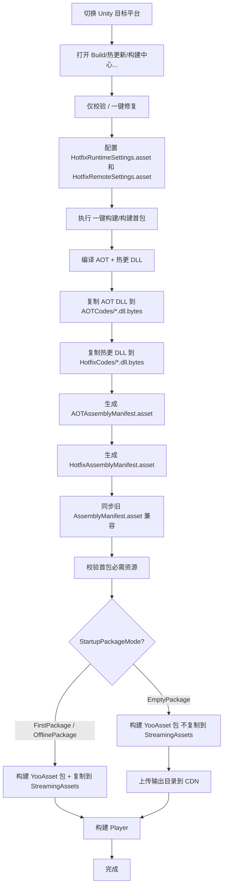
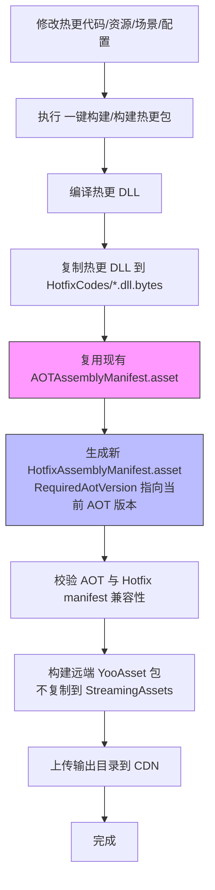
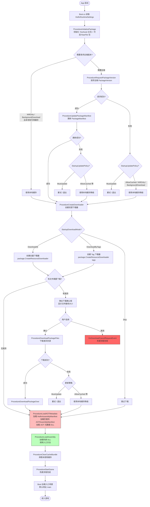
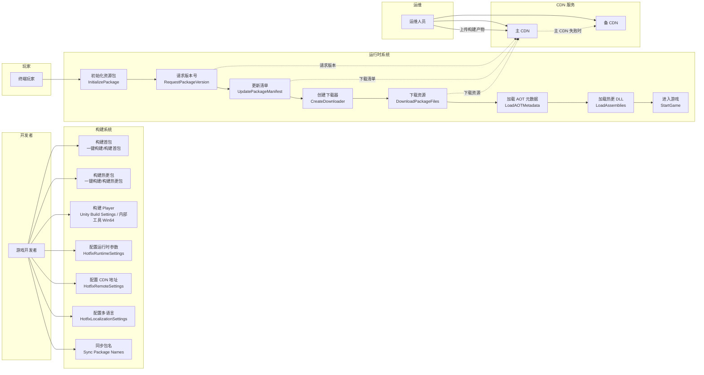
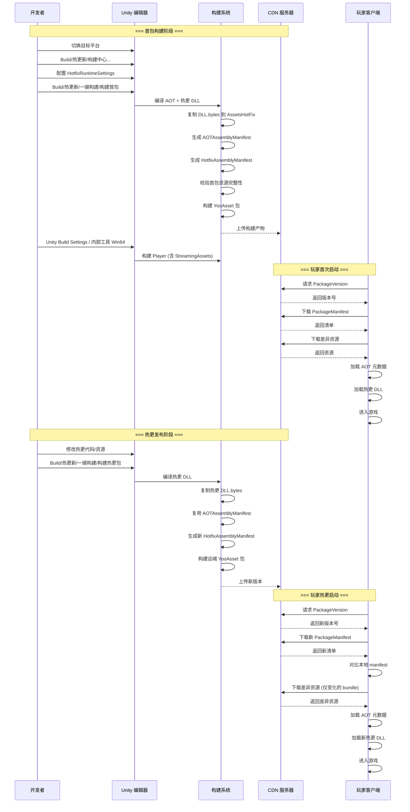

# qframework-hotfix

基于 **QFramework + YooAsset + HybridCLR** 的 Unity 热更新示例工程。

当前工程已支持：

- YooAsset 资源版本、远端 manifest、差异下载和本地缓存兜底。
- HybridCLR 热更 DLL 加载和 AOT 元数据补充。
- `AOTAssemblyManifest` 和 `HotfixAssemblyManifest` 分离，支持根据 `RequiredAotVersion` 匹配 AOT 版本。
- 首包、空包、离线包三种启动策略。
- 开发、测试、预发、正式环境 CDN 配置，支持主/备 CDN、平台、渠道、地区组合。
- 启动阶段下载确认、取消、重试、本地缓存降级和多语言提示。

## 环境要求

- Unity：`2022.3.62f2`
- YooAsset：`2.3.0-preview`
- HybridCLR：项目 `Packages/manifest.json` 中的 `com.code-philosophy.hybridclr`
- Luban：项目 `Packages/manifest.json` 中的 `com.code-philosophy.luban`
- 目标平台需先在 Unity Hub 安装对应 Build Support，例如 Android、iOS、WebGL、Windows、macOS。

首次打开工程后，建议先等待 Unity 完成 Package 导入和脚本编译。

## 快速开始

1. 打开项目。

   ```text
   /Users/mac/UnityFramework/qframework-hotfix
   ```

2. 切换目标平台。

   在 Unity 菜单 `File/Build Settings` 中选择目标平台并点击 `Switch Platform`。热更 DLL、AOT metadata 和 AssetBundle 都和平台相关，不能跨平台混用。

3. 安装 HybridCLR。

   ```text
   HybridCLR/Installer/Install
   ```

   不再建议新手直接执行 `HybridCLR/Generate/All`。首包构建时优先通过 `Build/热更新/构建中心...` 或一键构建入口触发统一流程。

4. 检查 HybridCLR 热更程序集。

   打开 `ProjectSettings/HybridCLRSettings.asset`，确认 `Hot Update Assembly Definitions` 包含需要热更的 asmdef。当前示例包括：

   ```text
   HotfixCommon
   HotfixDemo
   ```

5. 检查 YooAsset 收集器。

   打开 `YooAsset/AssetBundle Collector`，确认 `DefaultPackage` 至少收集以下路径：

   ```text
   Assets/AssetsPackage/AssetsHotFix/AOTCodes
   Assets/AssetsPackage/AssetsHotFix/HotfixCodes
   Assets/AssetsPackage/AssetsHotFix/Configs
   Assets/AssetsPackage/AssetsHotFix/HotfixDemo
   Assets/AssetsPackage/AssetsHotFix/Datas
   ```

6. 打开构建中心。

   ```text
   Build/热更新/构建中心...
   ```

   构建中心会显示当前 BuildTarget、AppVersion、远端环境、启动包策略、下载模式、入口资源、AOT Manifest 和 Hotfix Manifest 状态，并提供：

   ```text
   仅校验
   一键修复
   开始构建
   ```

7. 选择启动包策略。

   打开 `Assets/AssetsPackage/Resources/HotfixRuntimeSettings.asset`，设置：

   - `StartupPackageMode = FirstPackage`：首包内置启动资源，最常用。
   - `StartupPackageMode = EmptyPackage`：空包不内置资源，首次启动必须能访问远端。
   - `StartupPackageMode = OfflinePackage`：离线包完整内置资源，必须搭配 `OfflinePlayMode`。

8. 构建热更资源包。

   首包或首次远端资源：

   ```text
   Build/热更新/一键构建/构建首包
   ```

   后续热更资源：

   ```text
   Build/热更新/一键构建/构建热更包
   ```

9. 构建 Player。

   Windows 示例内部菜单：

   ```text
   Build/热更新/内部工具/旧命令/构建 Win64 Player
   ```

   其他平台可以使用 Unity `Build Settings`，构建前预处理器会校验 Player PlayMode、远端配置和启动包策略。

## 目录结构

```text
Assets/AssetsPackage
├── AssetsHotFix
│   ├── AOTCodes          # AOT metadata DLL.bytes
│   ├── HotfixCodes       # 热更程序集 DLL.bytes
│   ├── Configs           # AOTAssemblyManifest、HotfixAssemblyManifest、兼容旧清单
│   ├── HotfixDemo        # 示例热更资源
│   │   ├── Entities
│   │   └── Scenes        # 示例入口场景，默认地址 main
│   └── Datas             # 配表等热更数据
└── Scripts
    ├── Main              # 首包主工程代码，负责启动、下载和加载热更
    └── Hotfix            # 热更业务代码，编译为热更程序集
```

关键配置：

| 路径 | 用途 |
| --- | --- |
| `ProjectSettings/HybridCLRSettings.asset` | HybridCLR 热更程序集和 AOT metadata 配置 |
| `Assets/Resources/AssetBundleCollectorSetting.asset` | YooAsset 包和资源收集器配置 |
| `Assets/Editor/HybridCLR/HotfixBuildProfile.asset` | 构建时按平台自动设置 Player PlayMode |
| `Assets/AssetsPackage/Resources/HotfixRuntimeSettings.asset` | 启动包策略、下载策略、更新策略、包名 |
| `Assets/AssetsPackage/Resources/HotfixRemoteSettings.asset` | 环境、渠道、地区、主/备 CDN 地址 |
| `Assets/AssetsPackage/Resources/HotfixLocalizationSettings.asset` | 启动阶段中文和英文提示 |
| `Assets/AssetsPackage/AssetsHotFix/Configs/AOTAssemblyManifest.asset` | AOT 版本、平台、App 版本、AOT DLL 列表和 hash |
| `Assets/AssetsPackage/AssetsHotFix/Configs/HotfixAssemblyManifest.asset` | Hotfix 版本、兼容 App 版本、RequiredAotVersion、热更 DLL、入口资源 |
| `Assets/AssetsPackage/AssetsHotFix/Configs/AssemblyManifest.asset` | 旧清单，保留用于兼容和迁移 |

## 首包构建流程



## 热更包构建流程



## 运行时启动流程



## 用例图



## 角色与职责

| 角色 | 职责 | 关键操作 |
| --- | --- | --- |
| 游戏开发者 | 开发热更代码和资源，配置构建参数 | 编写热更代码、配置 Settings、构建首包/热更包、构建 Player |
| 运维人员 | 管理 CDN 和版本发布 | 上传构建产物到 CDN、监控版本分发、回滚版本 |
| 终端玩家 | 运行游戏客户端 | 启动 App、确认下载、等待热更完成、进入游戏 |

## 构建与热更时序



## 运行时流程

入口脚本：

```text
Assets/AssetsPackage/Scripts/Main/Runtime/Boot.cs
```

启动流程：

1. `Boot` 读取 `HotfixRuntimeSettings.asset`。
2. 初始化 YooAsset。
3. 创建 `ProcedureManager`。
4. `ProcedureInitializePackage` 初始化主资源包和可选 RawFile 包。
5. `ProcedureRequestPackageVersion` 请求远端 package version。
6. `ProcedureUpdatePackageManifest` 更新 package manifest。
7. `ProcedureCreateDownloader` 根据启动下载策略创建 downloader。
8. `ProcedureDownloadPackageFiles` 下载缺失或 hash 变化的 bundle。
9. `ProcedureLoadAOTMetadata` 先加载 `HotfixAssemblyManifest`，再加载匹配的 `AOTAssemblyManifest` 和 AOT metadata。
10. `ProcedureLoadAssembly` 加载热更 DLL，并记录本次可用的 `HotfixVersion + AotVersion` 组合。
11. `ProcedureClearCacheBundle` 清理缓存。
12. `Boot` 加载入口场景，默认地址是 `main`。

弱网或远端异常时，`StartupUpdatePolicy` 决定是否可以使用本地缓存或首包内置资源启动。

## 启动包策略

`HotfixRuntimeSettings.asset` 中的 `StartupPackageMode` 用来明确包体形态。

### FirstPackage

首包模式，推荐默认使用。

首包必须包含：

- 启动场景和主工程代码。
- YooAsset 内置 package manifest。
- `AOTAssemblyManifest.asset`。
- `HotfixAssemblyManifest.asset`。
- AOT metadata DLL.bytes。
- 首版热更 DLL.bytes。
- 入口场景或入口 prefab。
- 展示更新 UI、错误提示、本地缓存降级所需资源。

通过 `Build/热更新/构建中心...` 或 `Build/热更新/一键构建/构建首包` 构建时会校验上述资源是否存在，并把 YooAsset 构建产物复制到 `StreamingAssets`。

### EmptyPackage

空包模式不内置 YooAsset 启动资源，适合必须从远端拉取首个资源版本的场景。

要求：

- `PlayerPlayMode` 必须是 `HostPlayMode` 或 `WebPlayMode`。
- 首次启动时远端必须可访问。
- 启动下载策略建议使用 `DownloadAll`，或用 `DownloadByTags` 覆盖所有启动必需资源。
- 构建 `Build/热更新/一键构建/构建首包` 会生成远端资源包，但不会复制到 `StreamingAssets`。

空包不能搭配 `OfflinePlayMode`。如果远端不可用且本地从未成功缓存过资源，首次启动会失败并给出明确错误。

### OfflinePackage

离线包模式完整内置启动资源，不依赖远端。

要求：

- `StartupPackageMode = OfflinePackage`
- `PlayerPlayMode = OfflinePlayMode`
- 构建阶段会校验 AOT、Hotfix、manifest 和入口资源完整性。

离线包适合 Demo、审核包、展会包、内网包或不需要远端热更的发行形态。

## Runtime Settings

`Assets/AssetsPackage/Resources/HotfixRuntimeSettings.asset` 核心字段：

| 字段 | 说明 |
| --- | --- |
| `EditorPlayMode` | Editor 下使用的 YooAsset PlayMode |
| `PlayerPlayMode` | Player 下使用的 YooAsset PlayMode |
| `MainPackageName` | 主包名，默认 `DefaultPackage` |
| `IncludeRawFilePackage` | 是否启用 RawFile 包 |
| `RawFilePackageName` | RawFile 包名，默认 `RawFilePackage` |
| `StartupPackageMode` | `FirstPackage`、`EmptyPackage`、`OfflinePackage` |
| `StartupDownloadMode` | `DownloadAll`、`DownloadByTags`、`Skip` |
| `StartupUpdatePolicy` | `MustUpdate`、`AllowCached`、`WifiOnly`、`BackgroundDownload` |
| `StartupDownloadTags` | 主包启动阶段下载 Tag |
| `RawFileStartupDownloadTags` | RawFile 包启动阶段下载 Tag |

`StartupDownloadMode`：

- `DownloadAll`：下载全部差异资源。
- `DownloadByTags`：只下载指定 Tag。Tag 为空时不会创建 downloader。
- `Skip`：跳过启动下载，直接尝试加载当前本地可用资源。

`StartupUpdatePolicy`：

- `MustUpdate`：远端失败时只能重试或退出。
- `AllowCached`：远端失败时允许使用上次可用缓存或首包内置资源。
- `WifiOnly`：非 Wi-Fi 环境优先使用本地可用版本。
- `BackgroundDownload`：已有可用缓存时优先本地启动，后台下载入口由业务层继续接入。

## Remote Settings

Host/Web 模式远端地址由：

```text
Assets/AssetsPackage/Resources/HotfixRemoteSettings.asset
```

控制。不要在代码里写死 CDN 地址。

每个环境可以配置：

- `mainCdnUrlTemplate`：主 CDN 地址模板。
- `fallbackCdnUrlTemplate`：备用 CDN 地址模板，不能和主 CDN 完全相同。
- `requireHttps`：是否强制 HTTPS。
- `allowedDomains`：允许访问的域名白名单。
- `certificatePinningEnabled` 和 `certificatePublicKeyPin`：证书 pinning 预留。
- `enableGrayRelease`、`grayReleasePercent`、灰度 CDN 模板：CDN 灰度预留。

地址模板支持：

```text
{Environment}
{Platform}
{Channel}
{Region}
{PackageName}
```

示例：

```text
https://cdn.example.com/GameName/{Platform}/{Channel}/{Region}/{PackageName}
https://cdn-backup.example.com/GameName/{Platform}/{Channel}/{Region}/{PackageName}
```

运行时可以用 PlayerPrefs 覆盖环境、渠道、地区：

```csharp
PlayerPrefs.SetString("Hotfix.Remote.Environment", "Production");
PlayerPrefs.SetString("Hotfix.Remote.Channel", "official");
PlayerPrefs.SetString("Hotfix.Remote.Region", "cn");
PlayerPrefs.Save();
```

也可以直接覆盖主/备 CDN 模板：

```csharp
PlayerPrefs.SetString("Hotfix.Remote.MainUrl", "https://cdn.example.com/GameName/{Platform}/{Channel}/{Region}/{PackageName}");
PlayerPrefs.SetString("Hotfix.Remote.FallbackUrl", "https://cdn-backup.example.com/GameName/{Platform}/{Channel}/{Region}/{PackageName}");
PlayerPrefs.Save();
```

命令行覆盖：

```text
--hotfix-env=Production
--hotfix-channel=official
--hotfix-region=cn
--hotfix-main-url=https://cdn.example.com/GameName/{Platform}/{Channel}/{Region}/{PackageName}
--hotfix-fallback-url=https://cdn-backup.example.com/GameName/{Platform}/{Channel}/{Region}/{PackageName}
```

## Manifest 协议

当前运行时不再依赖单一 `AssemblyManifest`，而是使用两份清单。

### AOTAssemblyManifest

路径：

```text
Assets/AssetsPackage/AssetsHotFix/Configs/AOTAssemblyManifest.asset
```

字段：

- `AppVersion`：该 AOT metadata 对应的 App 版本。
- `BuildTarget`：平台，例如 `Windows`、`Android`、`iOS`、`macOS`。
- `AotVersion`：由 AppVersion、BuildTarget、AOT DLL 文件名、SHA256、大小生成。
- `AotMetadataAssemblies`：需要加载 metadata 的 AOT DLL 列表。
- `AotMetadataFiles`：AOT DLL 的 hash 和 size 记录。

### HotfixAssemblyManifest

路径：

```text
Assets/AssetsPackage/AssetsHotFix/Configs/HotfixAssemblyManifest.asset
```

字段：

- `AppVersionMin`：最小兼容 App 版本。
- `AppVersionMax`：最大兼容 App 版本。
- `BuildTarget`：平台。
- `RequiredAotVersion`：本次热更需要的 AOT 版本。
- `HotfixVersion`：由兼容版本、平台、RequiredAotVersion、热更 DLL 文件名、SHA256、大小生成。
- `HotUpdateAssemblies`：热更 DLL 列表。
- `HotUpdateFiles`：热更 DLL 的 hash 和 size 记录。
- `EntrySceneAddress`：热更完成后加载的场景地址，默认 `main`。
- `EntryPrefabAddress`：预留的入口 prefab 地址。
- `EntryTypeName` 和 `EntryMethodName`：可选静态入口方法。

运行时会校验：

- Hotfix manifest 和 AOT manifest 是否存在。
- `AppVersionMin <= Application.version <= AppVersionMax`。
- `BuildTarget` 是否匹配当前运行平台。
- `HotfixAssemblyManifest.RequiredAotVersion == AOTAssemblyManifest.AotVersion`。
- AOT DLL 和热更 DLL 列表不能为空。
- 入口场景或入口 prefab 至少配置一个。

校验失败会终止热更流程并显示明确错误。

## 构建首包

常规首包推荐使用 `FirstPackage`。

步骤：

1. 切换 Unity 目标平台。
2. 打开 `Build/热更新/构建中心...`，先执行 `仅校验`。
3. 必要时执行 `一键修复`，同步运行时包名和平台 PlayMode。
4. 检查 `HotfixRuntimeSettings.asset`：

   ```text
   StartupPackageMode = FirstPackage
   PlayerPlayMode = HostPlayMode
   StartupDownloadMode = DownloadAll
   StartupUpdatePolicy = AllowCached
   ```

5. 检查 `HotfixRemoteSettings.asset`，确保目标平台对应环境的主/备 CDN 合法。
6. 执行：

   ```text
   Build/热更新/一键构建/构建首包
   ```

该菜单会：

- 编译热更 DLL。
- 复制 AOT metadata 到 `AOTCodes/*.dll.bytes`。
- 复制热更 DLL 到 `HotfixCodes/*.dll.bytes`。
- 生成或更新 `AOTAssemblyManifest.asset`。
- 生成或更新 `HotfixAssemblyManifest.asset`。
- 同步旧 `AssemblyManifest.asset`，用于兼容迁移。
- 校验首包必需资源。
- 构建 YooAsset 包。
- `FirstPackage` 和 `OfflinePackage` 会复制构建产物到 `StreamingAssets`。

YooAsset 默认输出目录：

```text
Bundles/{UnityBuildTarget}/{PackageName}/{PackageVersion}
```

示例：

```text
Bundles/StandaloneOSX/DefaultPackage/2026-04-30-153012
Bundles/StandaloneWindows64/DefaultPackage/2026-04-30-153012
```

构建日志会输出：

```text
[BuildYooAssetPackage] Output: ...
```

## 构建空包首版远端资源

空包不是不需要资源，而是不把资源内置进安装包。

步骤：

1. 设置：

   ```text
   StartupPackageMode = EmptyPackage
   PlayerPlayMode = HostPlayMode 或 WebPlayMode
   StartupDownloadMode = DownloadAll
   ```

2. 执行：

   ```text
   Build/热更新/一键构建/构建首包
   ```

3. 将输出目录内容上传到 `HotfixRemoteSettings.asset` 解析出的 CDN 根目录。
4. 构建 Player。

空包构建会生成完整 YooAsset 远端资源，但不会复制到 `StreamingAssets`。首次启动必须能请求远端 package version 和 package manifest。

## 构建离线包

步骤：

1. 设置：

   ```text
   StartupPackageMode = OfflinePackage
   PlayerPlayMode = OfflinePlayMode
   ```

2. 执行：

   ```text
   Build/热更新/一键构建/构建首包
   ```

3. 构建 Player。

离线包不会依赖 CDN，适合固定内容交付。后续如果要切回热更模式，需要重新设置 `StartupPackageMode` 和 `PlayerPlayMode`。

## 构建热更包

当修改热更代码、资源、场景或配置后，执行：

```text
Build/热更新/一键构建/构建热更包
```

该菜单会：

- 编译热更 DLL。
- 更新 `HotfixCodes/*.dll.bytes`。
- 复用当前 `AOTAssemblyManifest.asset`。
- 构建前校验 AOT 基线指纹、AppVersion、BuildTarget 和 AOTCodes 文件 hash。
- 生成新的 `HotfixAssemblyManifest.asset`，其中 `RequiredAotVersion` 指向当前 AOT 版本。
- 校验 AOT 和 Hotfix manifest 兼容关系。
- 构建远端 YooAsset 包。
- 不复制到 `StreamingAssets`。
- 生成 `BuildReports/Hotfix/*.txt` 构建报告，并在报告中提示 CDN 上传目录。

热更构建不会移除 AOT 收集器。输出目录是一个完整资源版本目录，客户端会通过 YooAsset manifest 对比本地缓存，只下载缺失或 hash 变化的 bundle。AOT metadata 没变化时不会重复下载。

如果普通热更构建检测到 AOT 基线变化，会阻断构建并提示选择：

- `构建首包`：建立新的 App 基线。
- `构建 AOT 元数据补丁`：只在同一 App 基线下补充元数据。
- `取消`：停止本次构建。

## 构建 AOT 元数据补丁

AOT 元数据补丁是高级模式，只适用于：

```text
AOT 代码逻辑没有变化
但 Hotfix 需要补充新的泛型元数据
```

菜单：

```text
Build/热更新/高级/构建 AOT 元数据补丁
```

该流程会：

- 弹出风险确认。
- 校验旧 `AOTAssemblyManifest.asset` 与当前 AppVersion、BuildTarget 一致。
- 执行安全版 HybridCLR Generate All。
- 复制 AOT metadata DLL 和 Hotfix DLL。
- 重新生成 `AOTAssemblyManifest.asset` 和 `HotfixAssemblyManifest.asset`。
- 构建远端 YooAsset 包。
- 不复制到 `StreamingAssets`。
- 在构建报告中标记这是 AOT 元数据补丁。

如果修改了主工程 AOT 代码逻辑、公共接口、原生 SDK 或 PlayerSettings，应发布新 App，而不是发布 AOT 元数据补丁。

## 上传 CDN

构建输出目录形如：

```text
Bundles/{UnityBuildTarget}/{PackageName}/{PackageVersion}
```

将该目录下的文件上传到 `HotfixRemoteSettings.asset` 最终解析出的 URL 根目录。YooAsset 请求文件时会把文件名拼到根目录后面。

本地测试可以使用简单 HTTP 服务。示例：

```bash
cd Bundles/StandaloneOSX/DefaultPackage/2026-04-30-153012
python3 -m http.server 8080
```

然后把开发环境 CDN 模板临时设置为：

```text
http://127.0.0.1:8080
```

备用 CDN 不能和主 CDN 完全相同，可以使用另一个端口或另一个本地目录：

```bash
python3 -m http.server 8081
```

```text
http://127.0.0.1:8081
```

正式环境建议：

- 使用 HTTPS。
- 主/备 CDN 域名不同。
- 上传后校验版本文件、manifest 文件和 bundle 文件数量。
- 保留上一稳定版本，便于回滚。
- 不修改 YooAsset 生成的文件名。

## 构建 Player

Windows 示例：

```text
Build/热更新/内部工具/旧命令/构建 Win64 Player
```

该菜单会：

- 校验目标平台是否为 Windows。
- 应用 `HotfixBuildProfile.asset` 中的平台 PlayMode。
- 执行 `PrebuildCommand.GenerateAll()`。
- 构建 `Assets/Scenes/Boot.unity`。
- 构建首包 YooAsset 资源。
- 将 `StreamingAssets` 复制到 `Release-Win64/HybridCLRTrial_Data/StreamingAssets`。

其他平台可以用 Unity 原生 Build Settings。构建预处理器会调用：

```text
HotfixBuildProfileUtility.ApplyPlayModeToRuntimeSettingsForBuild
```

并校验：

- Player 不允许使用 `EditorSimulateMode`。
- WebGL 必须使用 `WebPlayMode`。
- 非 WebGL 不允许使用 `WebPlayMode`。
- `OfflinePackage` 必须使用 `OfflinePlayMode`。
- `EmptyPackage` 不允许使用 `OfflinePlayMode`。
- 远端配置必须通过目标平台校验。

## 按 Tag 下载

步骤：

1. 在 YooAsset Collector 中给资源收集器配置 `AssetTags`，例如：

   ```text
   ui
   battle
   chapter_1
   ```

2. 设置 `HotfixRuntimeSettings.asset`：

   ```text
   StartupDownloadMode = DownloadByTags
   StartupDownloadTags = ui,battle
   ```

3. 重新构建 YooAsset 包。

业务中可以按 Tag 下载：

```csharp
YooAssetKit.DownloadByTagsAsync(
    new[] { "ui", "battle" },
    onCompleted: downloader =>
    {
        if (downloader.Status != YooAsset.EOperationStatus.Succeed)
        {
            UnityEngine.Debug.LogError(downloader.Error);
        }
    },
    onUpdate: data =>
    {
        UnityEngine.Debug.Log($"download progress: {data.Progress}");
    });
```

按 Tag 加载：

```csharp
var prefabs = await YooAssetKit.LoadAssetsByTagAsync<UnityEngine.GameObject>("ui");
```

注意：按 Tag 加载前，相关 bundle 必须已经在本地可用。

## 下载取消和失败处理

启动阶段发现差异资源时，会弹出下载确认框：

- 点击确定：开始下载。
- 点击取消：触发 `OnDownloadCancelRequestEvent`，热更流程失败并显示取消原因。

业务代码可以主动取消：

```csharp
TypeEventSystem.Global.Send(new OnDownloadCancelRequestEvent
{
    reason = "用户取消资源下载。"
});
```

UI 层也可以调用：

```csharp
UIPanelRoot.Instance.RequestCancelDownload();
UIPanelRoot.Instance.RequestCancelDownloadWithReason("用户在下载中取消。");
```

下载失败后会提供重试或退出/使用本地缓存路径。`AllowCached`、`WifiOnly`、`BackgroundDownload` 会优先尝试上次可用缓存；`MustUpdate` 不使用缓存兜底。

## 多语言提示

启动阶段文案由：

```text
Assets/AssetsPackage/Resources/HotfixLocalizationSettings.asset
```

管理。

默认跟随系统语言。也可以覆盖：

```csharp
PlayerPrefs.SetString("Hotfix.Language", "English");
PlayerPrefs.Save();
```

命令行：

```text
--hotfix-language=ChineseSimplified
--hotfix-language=English
```

新增用户可见文案时，优先在 `HotfixTextKey` 中添加 key，并在 `HotfixLocalizationSettings.asset` 中补齐文本，再通过 `HotfixText.Get(...)` 使用。

## 常用菜单

```text
HybridCLR/Installer/Install
Build/热更新/构建中心...
Build/热更新/一键构建/构建首包
Build/热更新/一键构建/构建热更包
```

高级菜单需要明确风险后再使用：

```text
Build/热更新/高级/构建 AOT 元数据补丁
```

`内部工具` 下的菜单保留给框架维护、排障和分步验证，日常构建不需要手动点击：

```text
Build/热更新/内部工具/安全生成 HybridCLR 数据
Build/热更新/内部工具/仅构建首包 YooAsset
Build/热更新/内部工具/仅构建热更 YooAsset
Build/热更新/内部工具/复制 AOT 元数据 DLL
Build/热更新/内部工具/复制热更 DLL
Build/热更新/内部工具/校验运行时设置
Build/热更新/内部工具/旧命令/构建 Win64 Player
```

## 自检清单

构建前检查：

- 目标平台已切换。
- 构建中心的 `仅校验` 没有红色错误项。
- 热更 asmdef 已加入 HybridCLR Settings。
- YooAsset Collector 已收集 `AOTCodes`、`HotfixCodes`、`Configs` 和入口资源。
- `HotfixRuntimeSettings.asset` 的包名与 Collector 一致。
- `HotfixRemoteSettings.asset` 的主/备 CDN 不相同。
- `FirstPackage` / `OfflinePackage` 的启动资源完整。
- `EmptyPackage` 没有搭配 `OfflinePlayMode`。

构建后检查：

- `AOTAssemblyManifest.asset` 的 `BuildTarget` 和目标平台一致。
- `HotfixAssemblyManifest.asset` 的 `RequiredAotVersion` 等于 `AOTAssemblyManifest.asset` 的 `AotVersion`。
- `HotfixAssemblyManifest.asset` 的 App 兼容版本覆盖当前 `Application.version`。
- 输出目录存在版本文件、manifest 文件和 bundle 文件。
- 上传到 CDN 后，用浏览器或 curl 能访问版本文件和 manifest 文件。

## 常见问题

### 热更包是否是真正增量？

构建输出是完整版本目录，客户端下载是增量。YooAsset 会通过 manifest 对比本地缓存，只下载缺失或 hash 变化的 bundle。

### 为什么热更包里还能看到 AOT 相关资源？

热更构建保留 AOT 收集器，保证远端 manifest 能表达完整资源版本。只要 AOT metadata 文件 hash 没变，客户端不会重复下载。

### App 版本不兼容怎么办？

检查 `HotfixAssemblyManifest.asset`：

- `AppVersionMin`
- `AppVersionMax`

当前 `Application.version` 必须落在这个区间内。不兼容时客户端会拒绝加载热更，并提示更新 App 或更新资源。

### 平台不兼容怎么办？

检查 `AOTAssemblyManifest.asset` 和 `HotfixAssemblyManifest.asset` 的 `BuildTarget`。Windows、Android、iOS、WebGL、macOS、Linux 的 DLL 和 AssetBundle 不能混用。

### 新增热更程序集后没有加载？

检查：

1. 新 asmdef 是否加入 `HybridCLR/Settings -> Hot Update Assembly Definitions`。
2. 是否通过构建中心或 `Build/热更新/内部工具/安全生成 HybridCLR 数据` 生成过 HybridCLR 数据，或至少重新编译热更 DLL。
3. 是否执行 `Build/热更新/一键构建/构建热更包`。
4. `HotfixAssemblyManifest.asset` 的 `HotUpdateAssemblies` 是否包含新增 DLL。

### 修改资源后客户端下载不到？

检查：

1. 资源是否被 YooAsset Collector 收集。
2. 资源所在收集器是否有正确 Tag。
3. 是否上传了最新 YooAsset 输出目录。
4. `HotfixRemoteSettings.asset` 解析出的环境、平台、渠道、地区、包名目录是否正确。
5. CDN 是否缓存了旧版本文件。

### 何时必须重新发 App 包？

通常包括：

- 修改主工程启动代码。
- 修改 Unity、HybridCLR、YooAsset 关键版本或平台配置。
- 新热更代码需要的 AOT metadata 无法通过当前远端 AOT 版本覆盖。
- 修改原生插件、平台权限、启动场景、包体内置配置。
- 从离线包切换到远端热更包，或反向切换。

### 如何回滚？

回滚时不要只回滚热更 DLL。应回滚到一组兼容组合：

```text
HotfixVersion + RequiredAotVersion
```

也就是同时恢复对应的 `HotfixAssemblyManifest`、热更 DLL、资源文件，以及它要求的 AOT 版本。客户端会记录上次成功启动的 package version、AOT version、Hotfix version 和组合信息，用于本地缓存兜底。

## 致谢

- [QFramework](https://github.com/liangxiegame/QFramework)
- [YooAsset](https://github.com/tuyoogame/YooAsset)
- [HybridCLR](https://github.com/focus-creative-games/hybridclr)
